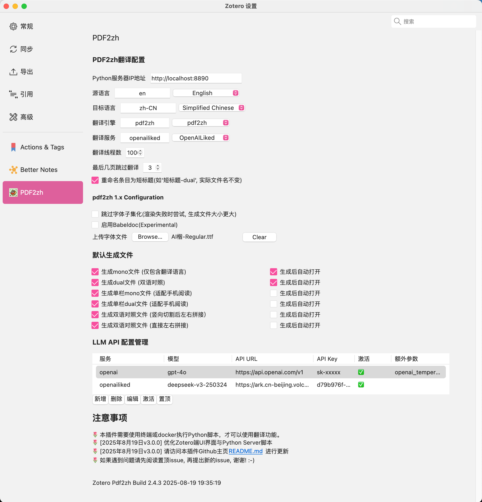

<div align="center">


<h2 id="title">Zotero PDF2zh</h2>

[](https://www.zotero.org)
[](https://github.com/windingwind/zotero-plugin-template)

[](https://github.com/guaguastandup/zotero-pdf2zh/blob/main/LICENSE)

在Zotero中使用[PDF2zh](https://github.com/Byaidu/PDFMathTranslate)和[PDF2zh_next](https://github.com/PDFMathTranslate/PDFMathTranslate-next)

新版本v3.0.15 | [旧版本v2.4.3](./2.4.3%20version/README.md)

</div>

# 如何使用本插件

本指南将引导您完成 Zotero PDF2zh 插件的安装和配置。

❓ 遇到问题

- 尝试向AI提问
- 在github issue区提问
- 发送问题到本插件用户QQ群: 971960014 入群验证回答: github

## 第一步: 安装uv/conda

**uv安装(推荐)**

```shell
# 方法一: 使用pip安装uv
pip install uv
# 方法二: 下载脚本安装
# macOS/Linux
wget -qO- https://astral.sh/uv/install.sh | sh
# windows
powershell -ExecutionPolicy ByPass -c "irm https://astral.sh/uv/install.ps1 | iex"
```

**conda安装**

```shell
# 1. 安装conda
# 参考本链接安装: https://www.anaconda.com/docs/getting-started/miniconda/install#windows-command-prompt
# 2. 测试conda
conda --version
# 3. 显示conda版本, 则conda安装完成
```

## 第二步: 下载项目文件

```shell
# 1. 创建并进入zotero-pdf2zh文件夹
mkdir zotero-pdf2zh && cd zotero-pdf2zh

# 2. 下载并解压server文件夹
# 如果server.zip下载失败, 可以直接访问: https://github.com/guaguastandup/zotero-pdf2zh/releases/download/v3.0.15-beta/server.zip 手动下载
wget https://raw.githubusercontent.com/guaguastandup/zotero-pdf2zh/refs/heads/main/server.zip
unzip server.zip

# 3. 进入server文件夹
cd server
```

## 第三步: 准备环境并执行

```shell
# 1. 安装依赖
pip install -r requirements.txt

# 2. 执行脚本
# 默认开启虚拟环境管理
# 默认使用uv进行虚拟环境管理
# 默认自动检查更新
# 默认端口号为8890
# 默认不开启winexe模式
python server.py

# 可选: 命令行参数:
# 如果要关闭虚拟环境管理
python server.py --enable_venv=False
# 如果要切换虚拟环境管理工具为conda
python server.py --env_tool=conda
# 如果要切换端口号
python server.py --port={Your Port Num}
# 是否检查更新
python server.py --check_update=False

# new feature for Windows user: 开启windows exe安装模式, 安装pdf2zh_next exe版本，将可执行文件路径输入到命令行参数(例如./pdf2zh-v2.4.3-BabelDOC-v0.4.22-win64/pdf2zh/pdf2zh.exe)
python server.py --enable_winexe=True --winexe_path='xxxxxxx'
```

> 💡 关于脚本自动更新的方法 1. 脚本自动检查更新(Experimental) 2. 通过git管理更新

## 第四步: 下载并安装插件

新版本v3.0.15[下载链接](https://github.com/guaguastandup/zotero-pdf2zh/releases/download/v3.0.15-beta/zotero-pdf-2-zh-v3.0.15.xpi)

## 第五步: Zotero端插件设置




**💡 注意事项**

- ⚠️⚠️（老用户必看！） 为了避免端口冲突，新版server脚本默认端口号为8890, 旧版本用户需要将Zotero配置页面的Python Server IP修改为: `http://localhost:8890`
- 切换翻译引擎pdf2zh/pdf2zh_next, 界面将显示不同引擎的翻译配置
- 翻译引擎pdf2zh的自定义字体：字体文件路径为本地路径。如果采用远端服务器部署, 暂时无法使用本配置，则需要手动修改`config.json`文件中的`NOTO_FONT_PATH`字段。


**💡 注意事项**

- 目前, 额外配置参数名需要与config文件中的字段相同(例如在pdf2zh_next中, openai对应的额外配置: `openai_temperature`和`openai_send_temperature`与`config.toml`文件中的字段相对应), 本功能将在未来继续优化, 可参考[文档](./server/doc/extraData.md)

# 关于翻译选项

对条目/附件单击右键, 可以看到四个翻译选项:


💡 注意事项

- **翻译PDF**: 点击原文PDF或论文条目, 将会生成在Zotero插件设置端所选择的默认生成文件
- **裁剪PDF**: 选择dual/mono类型附件, 将会对选择的附件在宽度1/2处裁剪, 然后上下拼接, 此功能适合手机阅读
    - 本选项会将页面两侧空白处进行裁剪
    - 若产生截断了原文内容的情况, 可将`server/utils/config.py`中的`config.pdf_w_offset`值降低
- **双语对照**: 点击此选项, 会生成左边为原文, 右边为翻译后文本的PDF
    - 选择"Dual文件翻译页在前"可以交换生成顺序
    - 此选项等同于翻译引擎为pdf2zh_next, 且`双语(Dual)文件显示模式`为**Left&Right**时生成的文件
- **双语对照(裁剪):** 此选项针对双栏PDF论文, 将会在每页生成单栏双语对照内容

示例:


# 致谢

- @Byaidu [PDF2zh](https://github.com/Byaidu/PDFMathTranslate)
- @awwaawwa [PDF2zh_next](https://github.com/PDFMathTranslate/PDFMathTranslate-next)
- @windingwind [zotero-plugin-template](https://github.com/windingwind/zotero-plugin-template)

# 贡献者

<a href="https://github.com/guaguastandup/zotero-pdf2zh/graphs/contributors"> </a>

# # Support me

💐 免费开源插件，您的支持是我继续开发的动力～

- 🤖 SiliconFlow邀请链接: https://cloud.siliconflow.cn/i/WLYnNanQ
- ☕️ Buy me a coffee https://github.com/guaguastandup/guaguastandup
