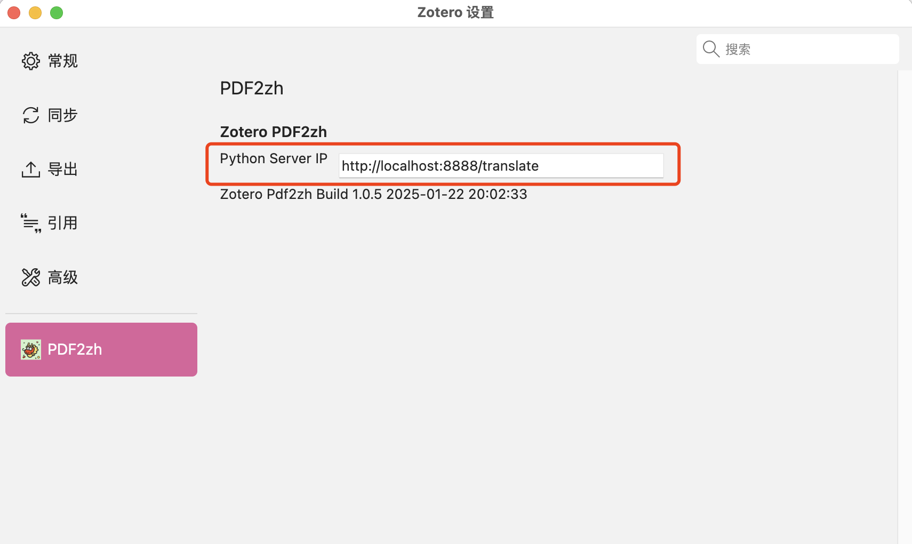
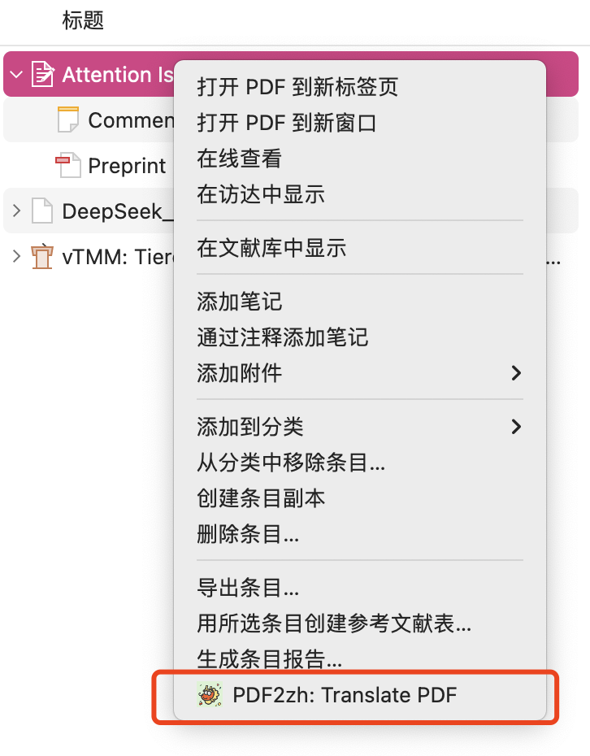
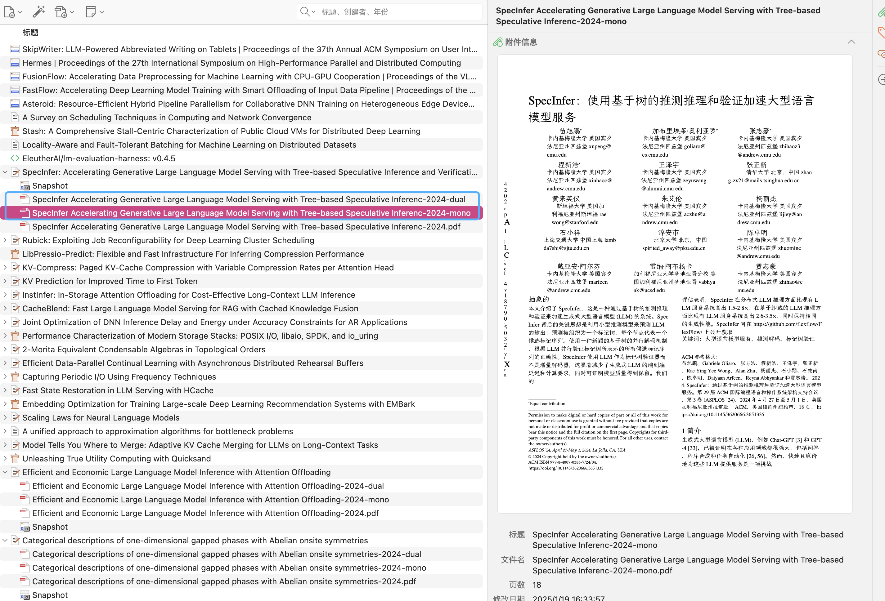
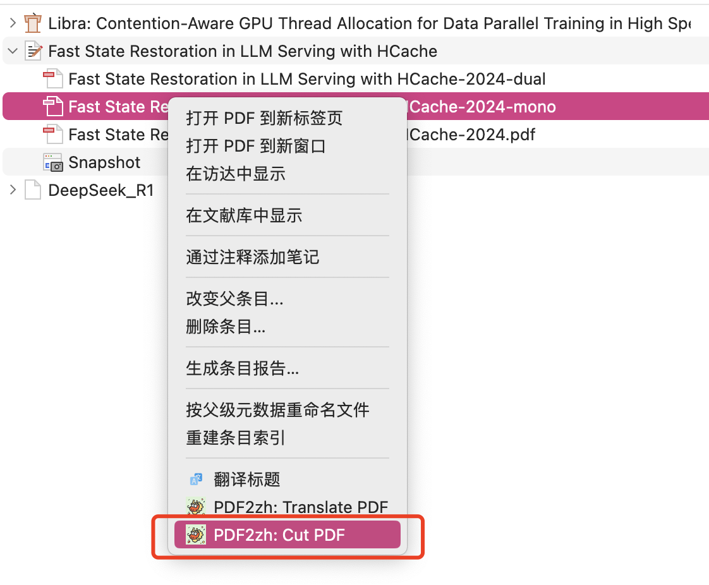
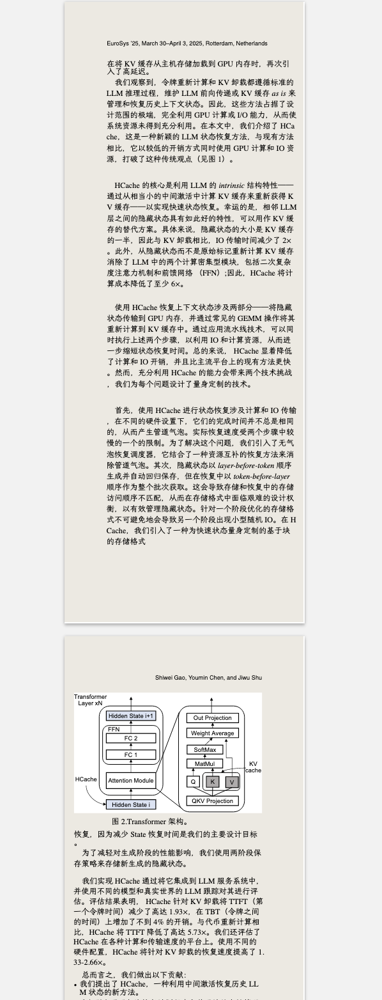

# Zotero PDF2zh


[](https://github.com/windingwind/zotero-plugin-template)
[](https://github.com/guaguastandup/zotero-pdf2zh/blob/master/LICENSE)


<!--  -->

在Zotero中使用[PDF2zh](https://github.com/Byaidu/PDFMathTranslate)

# 配置方法

## 第零步

在本地安装最新的[PDF2zh](https://github.com/Byaidu/PDFMathTranslate)

```cmd
pip install pdf2zh          # 安装pdf2zh
或
pip install --upgrade pdf2zh # 之前已经安装, 更新
```

本插件当前开发使用的 `pdf2zh`版本: v1.9.0

## 第一步

根据以下python脚本的注释, 按照个人需求修改配置，然后运行:

```python
from flask import Flask, request, jsonify
import os
import base64
import subprocess
from flask import Flask, send_file, abort
from pypdf import PdfWriter, PdfReader
from pypdf.generic import RectangleObject
import sys

####################################### 配置 #######################################
pdf2zh = "pdf2zh"                # 设置pdf2zh指令: 默认为'pdf2zh'
thread_num = 4                   # 设置线程数: 默认为4
port_num = 8888                  # 设置端口号: 默认为8888
service = 'bing'                 # 设置翻译服务: 默认为bing
translated_dir = "./translated/" # 设置翻译文件的输出路径(临时路径, 可以在翻译后删除)
config_path = './config.json'    # 设置配置文件路径
######################################################################################

def get_absolute_path(path): # 获取绝对路径
    if os.path.isabs(path):
        return path
    else:
        return os.path.abspath(path)

def get_file_from_request(request): # 从request中解析pdf文件
    data = request.get_json()
    path = data.get('filePath')
    path = path.replace('\\', '/') # 把所有反斜杠\替换为正斜杠/ (Windows->Linux/MacOS)
    if not os.path.exists(path):
        file_content = data.get('fileContent')
        input_path = os.path.join(translated_dir, os.path.basename(path))
        if file_content:
            if file_content.startswith('data:application/pdf;base64,'): # 移除 Base64 编码中的前缀(如果有)
                file_content = file_content[len('data:application/pdf;base64,'):]
            file_data = base64.b64decode(file_content) # 解码 Base64 内容
            with open(input_path, 'wb') as f:
                f.write(file_data)
    else:
        input_path = path
    return input_path

app = Flask(__name__)
@app.route('/translate', methods=['POST'])
def translate():
    print("### translate ###")
    input_path = get_file_from_request(request)
    try:
        os.makedirs(translated_dir, exist_ok=True)
        print("### translating ###: ", input_path)

        # 执行pdf2zh翻译, 用户可以自定义命令内容:
        command = [
            pdf2zh,
            input_path,
            '--t', str(thread_num),
            '--output', translated_dir,
            '--service', service
        ]
        subprocess.run(command, check=False)
        abs_translated_dir = get_absolute_path(translated_dir)
        print("abs_translated_dir: ", abs_translated_dir)
        translated_path1 = os.path.join(abs_translated_dir, os.path.basename(input_path).replace('.pdf', '-mono.pdf'))
        translated_path2 = os.path.join(abs_translated_dir, os.path.basename(input_path).replace('.pdf', '-dual.pdf'))
        if not os.path.exists(translated_path1) or not os.path.exists(translated_path2):
            raise Exception("pdf2zh failed to generate translated files")
        return jsonify({'status': 'success', 'translatedPath1': translated_path1, 'translatedPath2': translated_path2}), 200
    except Exception as e:
        print(f"Error: {e}")
        return jsonify({'status': 'error', 'message': str(e)}), 500

@app.route('/translatedFile/<filename>')
def download(filename):
    directory = translated_dir
    abs_directory = get_absolute_path(directory)
    file_path = os.path.join(abs_directory, filename)
    if not os.path.isfile(file_path):
        return "File not found", 404
    return send_file(file_path, as_attachment=True, download_name=filename)

# 新增了一个cut pdf函数，用于切割双栏pdf文件
def split_and_merge_pdf(input_pdf, output_pdf):
    writer = PdfWriter()
    if 'dual' in input_pdf:
        reader1_1 = PdfReader(input_pdf)
        reader1_2 = PdfReader(input_pdf)
        reader2_1 = PdfReader(input_pdf)
        reader2_2 = PdfReader(input_pdf)
        for i in range(0, len(reader1_1.pages), 2):
            page1_1 = reader1_1.pages[i]
            page1_2 = reader1_2.pages[i]
            page2_1 = reader2_1.pages[i+1]
            page2_2 = reader2_2.pages[i+1]

            original_media_box = page1_1.mediabox
            width = original_media_box.width
            height = original_media_box.height

            left_page_1 = page1_1
            left_page_1.mediabox = RectangleObject((0, 0, width / 2, height))
            left_page_2 = page2_1
            left_page_2.mediabox = RectangleObject((0, 0, width / 2, height))

            right_page_1 = page1_2
            right_page_1.mediabox = RectangleObject((width / 2, 0, width, height))
            right_page_2 = page2_2
            right_page_2.mediabox = RectangleObject((width / 2, 0, width, height))

            writer.add_page(left_page_1)
            writer.add_page(left_page_2)
            writer.add_page(right_page_1)
            writer.add_page(right_page_2)
    else:
        reader1 = PdfReader(input_pdf)
        reader2 = PdfReader(input_pdf)
        for i in range(len(reader1.pages)):
            page1 = reader1.pages[i]
            page2 = reader2.pages[i]

            original_media_box = page1.mediabox
            width = original_media_box.width
            height = original_media_box.height

            left_page = page1
            left_page.mediabox = RectangleObject((0, 0, width / 2, height))

            right_page = page2
            right_page.mediabox = RectangleObject((width / 2, 0, width, height))

            writer.add_page(left_page)
            writer.add_page(right_page)

    with open(output_pdf, "wb") as output_file:
        writer.write(output_file)

# 新增了一个cut接口，用于切割双栏pdf文件
@app.route('/cut', methods=['POST'])
def cut():
    print("### cut ###")
    input_path = get_file_from_request(request)
    try:
        os.makedirs(translated_dir, exist_ok=True)
        print("### cutting ###: ", input_path)
        abs_translated_dir = get_absolute_path(translated_dir)
        translated_path = os.path.join(abs_translated_dir, os.path.basename(input_path).replace('.pdf', '-cut.pdf'))
        split_and_merge_pdf(input_path, translated_path)
        if not os.path.exists(translated_path):
            raise Exception("failed to generate cutted files")
        return jsonify({'status': 'success'}), 200
    except Exception as e:
        print(f"Error: {e}")
        return jsonify({'status': 'error', 'message': str(e)}), 500

if __name__ == '__main__':
    if len(sys.argv) > 1: # 命令行参数1: service
        service = sys.argv[1]
    if len(sys.argv) > 2: # 命令行参数2: thread_num
        thread_num = int(sys.argv[2])
    app.run(host='0.0.0.0', port=port_num)
```

### 添加配置文件 & 修改翻译中文字体（可选）

推荐使用霞鹜文楷字体, 配置方法:

0. 下载霞鹜文楷字体: https://github.com/lxgw/LxgwWenKai/releases/download/v1.510/LXGWWenKai-Regular.ttf
1. 新建config.json文件

```json
{
    "NOTO_FONT_PATH": "./LXGWWenKai-Regular.ttf"
}
```

`NOTO_FONT_PATH`为您的自定义字体路径

2. 修改python脚本:

```python
步骤1: 设置配置文件路径:
config_path = './config.json'     # 设置配置文件路径

步骤二: 在command中添加config_path选项
command = [
    pdf2zh,
    input_path,
    '--t', str(thread_num),
    '--output', translated_dir,
    '--service', service,
    '--config', config_path # 这是添加的配置文件路径
]
```

3. 其他配置的修改同理: 具体参考: [PDF2zh Config File](https://github.com/Byaidu/PDFMathTranslate/blob/main/docs/ADVANCED.md#cofig)

## 第二步

在Zotero-设置中，输入您的Python Server IP，按回车键确认。

默认为: `http://localhost:8888`



# 使用方法

## 基础功能: PDF翻译

右键选择条目或者附件 - 点击 Translate PDF

- 如果选择条目的话，将会自动选择该条目下创建时间最早的PDF。

 

条目中将会添加两个翻译后的文件



## 新功能: 双栏PDF分割

✨ 将双栏论文剪切拼接为单栏显示，适配手机阅读!

右键选择条目或者附件 - 点击 Cut PDF

- 如果选择条目的话，将会自动选择该条目下创建时间最早的PDF。

 

条目中将会添加一个分割后的文件

 

# 致谢

- @Byaidu [PDF2zh](https://github.com/Byaidu/PDFMathTranslate)
- @windingwind [zotero-plugin-template](https://github.com/windingwind/zotero-plugin-template)

# 💗

欢迎提issue或者参与贡献

# TODO LIST

- [x] 支持远程部署
- [ ] 跨平台部署测试 (on-going)
- [ ] 加入插件市场
- [ ] 支持在zotero perference中设置pdf2zh参数
