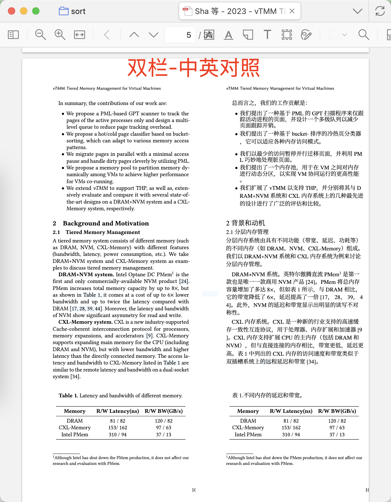
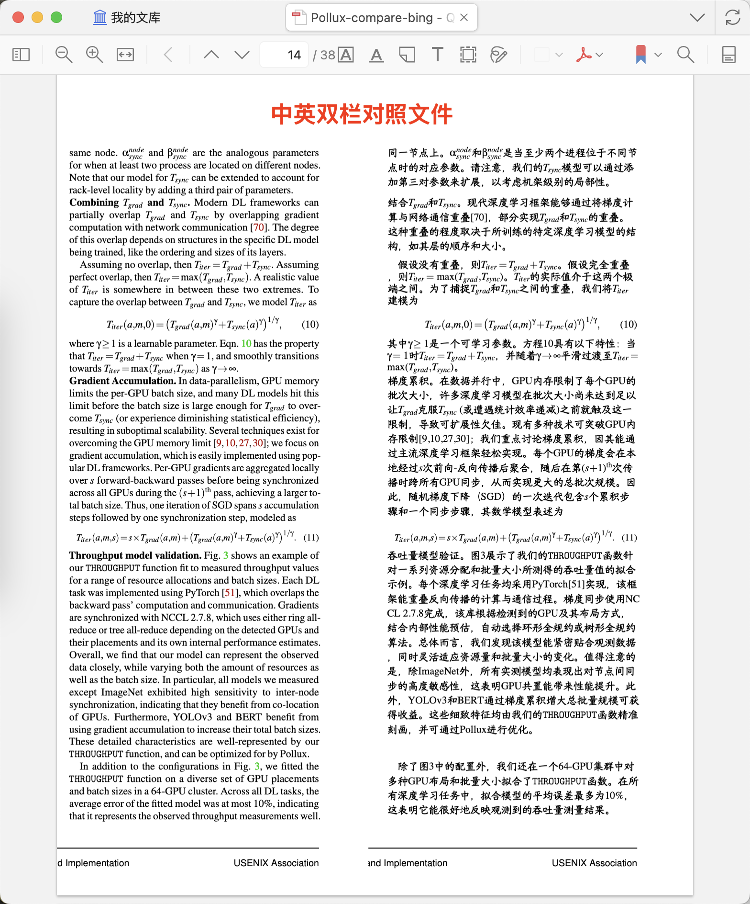

<div align="center">


<h2 id="title">Zotero PDF2zh</h2>

[](https://www.zotero.org)
[](https://www.zotero.org/support/beta_builds)
[](https://github.com/windingwind/zotero-plugin-template)

[](https://github.com/guaguastandup/zotero-pdf2zh/blob/main/LICENSE)
[![zread](https://img.shields.io/badge/Ask_Zread-_.svg?style=flat&color=00b0aa&labelColor=000000&logo=data%3Aimage%2Fsvg%2Bxml%3Bbase64%2CPHN2ZyB3aWR0aD0iMTYiIGhlaWdodD0iMTYiIHZpZXdCb3g9IjAgMCAxNiAxNiIgZmlsbD0ibm9uZSIgeG1sbnM9Imh0dHA6Ly93d3cudzMub3JnLzIwMDAvc3ZnIj4KPHBhdGggZD0iTTQuOTYxNTYgMS42MDAxSDIuMjQxNTZDMS44ODgxIDEuNjAwMSAxLjYwMTU2IDEuODg2NjQgMS42MDE1NiAyLjI0MDFWNC45NjAxQzEuNjAxNTYgNS4zMTM1NiAxLjg4ODEgNS42MDAxIDIuMjQxNTYgNS42MDAxSDQuOTYxNTZDNS4zMTUwMiA1LjYwMDEgNS42MDE1NiA1LjMxMzU2IDUuNjAxNTYgNC45NjAxVjIuMjQwMUM1LjYwMTU2IDEuODg2NjQgNS4zMTUwMiAxLjYwMDEgNC45NjE1NiAxLjYwMDFaIiBmaWxsPSIjZmZmIi8%2BCjxwYXRoIGQ9Ik00Ljk2MTU2IDEwLjM5OTlIMi4yNDE1NkMxLjg4ODEgMTAuMzk5OSAxLjYwMTU2IDEwLjY4NjQgMS42MDE1NiAxMS4wMzk5VjEzLjc1OTlDMS42MDE1NiAxNC4xMTM0IDEuODg4MSAxNC4zOTk5IDIuMjQxNTYgMTQuMzk5OUg0Ljk2MTU2QzUuMzE1MDIgMTQuMzk5OSA1LjYwMTU2IDE0LjExMzQgNS42MDE1NiAxMy43NTk5VjExLjAzOTlDNS42MDE1NiAxMC42ODY0IDUuMzE1MDIgMTAuMzk5OSA0Ljk2MTU2IDEwLjM5OTlaIiBmaWxsPSIjZmZmIi8%2BCjxwYXRoIGQ9Ik0xMy43NTg0IDEuNjAwMUgxMS4wMzg0QzEwLjY4NSAxLjYwMDEgMTAuMzk4NCAxLjg4NjY0IDEwLjM5ODQgMi4yNDAxVjQuOTYwMUMxMC4zOTg0IDUuMzEzNTYgMTAuNjg1IDUuNjAwMSAxMS4wMzg0IDUuNjAwMUgxMy43NTg0QzE0LjExMTkgNS42MDAxIDE0LjM5ODQgNS4zMTM1NiAxNC4zOTg0IDQuOTYwMVYyLjI0MDFDMTQuMzk4NCAxLjg4NjY0IDE0LjExMTkgMS42MDAxIDEzLjc1ODQgMS42MDAxWiIgZmlsbD0iI2ZmZiIvPgo8cGF0aCBkPSJNNCAxMkwxMiA0TDQgMTJaIiBmaWxsPSIjZmZmIi8%2BCjxwYXRoIGQ9Ik00IDEyTDEyIDQiIHN0cm9rZT0iI2ZmZiIgc3Ryb2tlLXdpZHRoPSIxLjUiIHN0cm9rZS1saW5lY2FwPSJyb3VuZCIvPgo8L3N2Zz4K&logoColor=ffffff)](https://zread.ai/guaguastandup/zotero-pdf2zh)

在Zotero中使用[PDF2zh](https://github.com/Byaidu/PDFMathTranslate)和[PDF2zh_next](https://github.com/PDFMathTranslate/PDFMathTranslate-next)

新版本v3.0.35 | [旧版本v2.4.3](./2.4.3%20version/README.md)

</div>

[TOC]

# 如何使用本插件

本指南将引导您完成 Zotero PDF2zh 插件的安装和配置。

❓ 遇到问题

- 跳转至本项目总结的常见问题：[常见问题(FAQ)](https://github.com/guaguastandup/zotero-pdf2zh?tab=readme-ov-file#%E5%B8%B8%E8%A7%81%E9%97%AE%E9%A2%98faq)
- 阅读[**常见问题文档**](https://docs.qq.com/markdown/DU0RPQU1vaEV6UXJC) by [@Rosetears520](https://github.com/Rosetears520)
- 基础问题（例如如何安装python，如何安装conda等问题）请向AI提问
- 在github issue区提问
- QQ群提问:
    - 提问时需要遵循规则: **确保已经阅读过issue区和常见问题文档，重复问题不会得到回复。确定问题为新问题后, 将终端报错复制到txt文件, 并截图zotero插件设置端配置**
    - 1群: 971960014(已满)
    - 2群: 897867369(已满)
    - 3群: 1064375380
    - 入群问题答案: github
- 访问视频教程
    - 请注意，视频教程并不包含所有的注意事项，也会存在步骤遗漏，也不能保证适配最新版本插件，如果您遇到问题，请您优先以本项目主页的安装指南和文字说明为准。
    - 如果您为本插件制作了教程，可以对在本区域提交您的视频链接，感谢您做出的贡献!
    - 来自bilibili[@她笑中藏泪花](https://space.bilibili.com/3493121191054300)的视频教程: [【Zotero-pdf2zh】快速搞定 PDF 翻译，完美保留原文格式](https://www.bilibili.com/video/BV1FnHYzeEfj/?share_source=copy_web&vd_source=a492b2fdd5febb228a648d598595ea6e)
    - 来自bilibili[@尛希](https://space.bilibili.com/347580558)的视频教程: [【zotero PDF文献翻译，无需会员，本地部署，超简易教程，人人都可部署成功】](https://www.bilibili.com/video/BV1hraMzuEP8/?share_source=copy_web&vd_source=a492b2fdd5febb228a648d598595ea6e)
- 想要使用Docker进行部署？
    - 请参考：[Docker部署方法一](./docker/README.md) by [@Rosetears520](https://github.com/Rosetears520)
    - 请参考：[Docker部署方法二](./docker2/README.md) by [@taozhe6](https://github.com/taozhe6)

# 安装说明

## 第零步：安装Python和Zotero

- [Python下载链接](https://www.python.org/downloads/) 建议下载3.12.0版本Python
  - 安装教程推荐：[【Windows | 安装Python和PyCharm】](https://www.bilibili.com/video/BV18q4y1R7gW/?share_source=copy_web&vd_source=7295b9ad781950043e4c60b3aabd0c72)

- 插件目前支持[Zotero 7](https://www.zotero.org/download/)以及Zotero 8(适配 by @[Aphcity](https://github.com/Aphcity))

- 打开cmd/终端，执行以下指南中的指令 （windows用户请用**管理员身份**打开cmd.exe）

## 第一步: 安装uv/conda

如果不使用虚拟环境管理，请参考[FAQ](https://github.com/guaguastandup/zotero-pdf2zh?tab=readme-ov-file#faq)

**uv安装(推荐)**

1. 安装uv
```shell
# 方法一: 下载脚本安装(推荐)
# macOS/Linux
wget -qO- https://astral.sh/uv/install.sh | sh
# windows
powershell -ExecutionPolicy ByPass -c "irm https://astral.sh/uv/install.ps1 | iex"

# 方法二: pip安装
pip install uv
```

2. 检查uv安装是否成功
```shell
# 显示uv版本号, 则uv安装完成（必做）
# 如果您的uv安装检查失败了，请您优先排查这个问题，不要进行第二步操作。
uv --version
```

3. 如果检查失败
需要将uv执行路径添加到全局路径，并重启终端。注意将Username替换为您自己的用户名。

```shell
# MacOS/Linux
export PATH="$PATH:/Users/Username/.local/bin"
# Windows
$env:Path = "C:\Users\Username\.local\bin;$env:Path"
```

**conda安装**

1. 安装conda
参考本链接安装: https://www.anaconda.com/docs/getting-started/miniconda/install#windows-command-prompt

2. 检查conda安装是否成功
```shell
# 显示conda版本号, 则conda安装完成
# 如果您的conda安装检查失败了，请您优先排查这个问题，不要进行第二步操作。
conda --version
```

## 第二步: 下载项目文件

```shell
# 1. 创建并进入zotero-pdf2zh文件夹
mkdir zotero-pdf2zh && cd zotero-pdf2zh

# 2. 下载并解压server文件夹
# 如果server.zip下载失败, 可以直接访问: https://github.com/guaguastandup/zotero-pdf2zh/releases/download/v3.0.35/server.zip 手动下载
wget https://raw.githubusercontent.com/guaguastandup/zotero-pdf2zh/refs/heads/main/server.zip
unzip server.zip

# 3. 进入server文件夹
cd server
```

## 第三步: 准备环境并执行

1. **安装依赖**
```shell
pip install -r requirements.txt
```

本项目的Python脚本可以在执行过程中启动虚拟环境，并在虚拟环境中安装必要的包，并且实现pdf2zh与pdf2zh_next两种引擎的虚拟环境之间的切换。

您只需要选择一个虚拟环境工具: `uv`或`conda`

并且，为了避免在执行过程中出现虚拟环境安装失败的问题，您可以尝试**预热版本**，先安装好虚拟环境再启动脚本。

-   请注意，预热只需要在首次安装时执行，之后只需要执行`python server.py`

如果您确定您系统中的uv或conda是正常的，并且可以正常安装一些Python包（不存在网络问题等），那么不需要使用预热版本。

2. **如果您选择conda**

预热版本
```shell
# 1. 利用conda预热(首次安装)
# Windows用户:
.\install-with-conda.bat --warmup
# MacOS/Linux用户:
./install-with-conda.sh  --warmup

# 预热后，您需要检查命令行中是否提示安装成功，如果安装失败，请不要进行下一步

# 2. 执行脚本
python server.py --env_tool=conda --skip_install=True

# install-with-conda.sh有三个选项:
# --warmup 对babeldoc的资源文件进行预热(需要一些时间)
# --upgrade 对当前包进行升级
# --no-mirror 不使用国内镜像源
```

非预热版本
```shell
# 指定虚拟环境工具为conda
python server.py --env_tool=conda
```

3. **如果您选择uv**

预热版本
```shell
# 1. 利用uv预热(首次安装)
# Windows用户:
.\install-with-uv.bat --warmup
# MacOS/Linux用户:
./install-with-uv.sh --warmup

# 预热后，您需要检查命令行中是否提示安装成功，如果安装失败，请不要进行下一步

# 2. 执行脚本
python server.py --skip_install=True

# install-with-uv.sh有三个选项:
# --warmup 对babeldoc的资源文件进行预热(需要一些时间)
# --upgrade 对当前包进行升级
# --no-mirror 不使用国内镜像源
```

非预热版本
```shell
python server.py
```

请注意, 翻译功能依赖本Python脚本, **需要保持脚本的运行状态**,只要您需要使用翻译功能，就不要关闭这个Python脚本。

当您执行`python server.py`时，对应的默认选项是:

>   - 默认开启虚拟环境管理
>   - 默认使用uv进行虚拟环境管理
>   - 默认在脚本执行过程安装必要的包（而不是预热）
>   - 默认自动检查更新
>   - 默认自动更新源为 github
>   - 默认端口号为**8890**
>   - 默认不开启winexe模式
>   - 默认启用国内镜像进行必要包安装
>   - 默认使用镜像为中科大镜像源

- 如果要关闭虚拟环境管理: `python server.py --enable_venv=False`
- 如果要切换虚拟环境管理工具为conda: `python server.py --env_tool=conda`
- 如果要切换端口: `python server.py --port={Your Port Num}`
- 如果要关闭自动检查更新: `python server.py --check_update=False`
- 如果要切换自动更新源为gitee: `python server.py --update_source="gitee"`
- 如果要关闭包安装时启用镜像: `python server.py --enable_mirror=False`
- 如果要自定义镜像源: `python server.py --mirror_source="https://mirrors.tuna.tsinghua.edu.cn/pypi/web/simple/"` 
- 开启windows exe安装模式, 安装pdf2zh_next exe版本，将可执行文件路径输入到命令行参数(例如./pdf2zh-v2.6.3-BabelDOC-v0.5.7-win64/pdf2zh/pdf2zh.exe): `python server.py --enable_winexe=True --winexe_path='xxxxxxx'`

P.S. 注意事项: 如果使用uv方法安装，在安装后请不要移动server文件夹，也不要修改文件夹名。

## 第四步: 下载并安装插件

新版本v3.0.35[下载链接](https://github.com/guaguastandup/zotero-pdf2zh/releases/download/v3.0.35/zotero-pdf-2-zh.xpi)

您可以在zotero中检查更新，或选择自动更新，来获取最新版本插件。

在zotero中打开“工具-插件”，将xpi文件拖入，进行安装。（若拖入后功能未生效，请重启Zotero后再试）

## 第五步: Zotero端插件设置

<div align=center>

</div>


**配置选项说明**

- 切换翻译引擎`pdf2zh/pdf2zh_next`，界面将显示不同引擎的翻译配置

- 关于**qps**和**poolsize**选项：请参考您的服务商（例如[zhipu](https://www.bigmodel.cn/dev/howuse/rate-limits)）。

    >   - 计算公式: `qps = rpm / 60`
    >   - 对于上游为**qps/rpm限速**：pool size = qps * 10; 
    >   - 对于上游为**并发数限制**: pool size = max(向下取整(0.9*官方并发数限制), 官方并发数限制-20)，qps = pool size
    >   - 如果您不知道怎么设置, 请直接设置qps即可, pool size设置为默认值0即可

- 翻译引擎pdf2zh的自定义字体：字体文件路径为本地路径。如果采用远端服务器部署，暂时无法使用本配置，则需要手动修改`config.json`文件中的`NOTO_FONT_PATH`字段。

- 目前, 额外配置参数名需要与config文件中的字段相同(例如在pdf2zh_next中, openai对应的额外配置: `openai_temperature`和`openai_send_temperature`与`config.toml`文件中的字段相对应), 本功能将在未来继续优化, 可参考[文档](./server/doc/extraData.md)


**翻译服务说明**

单击LLM API配置管理处的新增，弹出此窗口，进行服务配置。

-   您可以为同一个服务添加多种配置，但是您只能激活其中一种，在翻译时会使用您激活的配置
-   在配置LLM API后，您还需要在上方设置的翻译服务处选择您需要使用的服务

<div align=center>

</div>


**💡 翻译服务介绍**

| 服务类型                | 服务名称         | 服务介绍                                                     | 💡注意事项                                                    |
| ----------------------- | ---------------- | ------------------------------------------------------------ | ------------------------------------------------------------ |
| 免费&免配置的翻译服务   | siliconflowfree  | 基于硅基流动提供的GLM4-9B模型, 仅支持翻译引擎pdf2zh_next，由[@硅基流动](https://www.siliconflow.cn/)、[@pdf2zh_next](https://github.com/PDFMathTranslate/PDFMathTranslate-next) 和 [@BabelDOC](https://github.com/funstory-ai/BabelDOC)联合提供服务 | 1. 此服务无需选择qps，默认为40<br />2.此服务可能会存在漏翻译的情况，如果需要高质量翻译请优先选择其他服务<br />3. 此服务仅支持pdf2zh_next引擎 |
| 免费&免配置的翻译服务   | bing/google      | bing/google的官方机器翻译                                    | bing和goole的翻译服务都存在限流，如果翻译失败，请将并发数设置调至2及以下重试 |
| 具有优惠/赠送的翻译服务 | openaliked       | 加入[火山引擎协作计划](https://console.volcengine.com/ark/region:ark+cn-beijing/openManagement?OpenAuthorizeModal=true&OpenTokenDrawer=false)，个人用户每个模型每天最多赠送50w token | 1. 协作计划的额度赠送规则是：按照前一天参加协作的token量等额计算（例如您昨天使用了10w token，那么今天的赠送额度则为10w token）上限为50w，请注意检查自己的额度使用情况，避免超额<br />2. 此服务支持高并发数：可设置并发数为500~1000 |
| 具有优惠/赠送的翻译服务 | silicon          | 通过邀请好友可以获得14元赠送金额                             | 1. 此服务url需填写为: `https://api.siliconflow.cn/v1`，如果后面有completions等后缀，请删除。<br />2. 此服务免费版支持的线程数较低，建议设置为6左右 |
| 具有优惠/赠送的翻译服务 | zhipu            | 智谱部分模型可支持免费调用                                   | 免费服务的并发数不要设置过高，建议设置为6以内                |
| 高质量服务              | aliyunDashScope  | 翻译效果较好，新用户有赠送额度，可以尝试                     | 选择LLM API配置管理中的默认模型选项                          |
| 高质量服务              | deepseek（推荐） | 翻译效果好，有缓存命中机制                                   | 使用deepseek v3服务即可                                      |

-   除了免费服务，您均需要配置自己的API Key和URL才可以使用翻译服务（某些服务不需要配置URL，可以忽略）
-   您可以根据实际情况自行调整并发数

- **openailiked服务选项**可以填写所有兼容openai格式的LLM服务, 您需要填写您的LLM服务供应商提供的URL, API Key, Model名称等信息。

    - 示例: 火山引擎url填写为`https://ark.cn-beijing.volces.com/api/v3`


## 第六步

在Zotero中对条目/PDF右键，选择PDF2zh-翻译选项，进行翻译。

### 关于翻译选项

对条目/附件单击右键, 可以看到四个翻译选项:

<div align=center>

</div>

**💡 翻译选项解析**

| 翻译选项                              | 解释                                                         | 示例图片                                                     |
| ------------------------------------- | ------------------------------------------------------------ | ------------------------------------------------------------ |
| **翻译PDF (translate PDF)**           | 点击原文PDF或论文条目, 将会生成在Zotero插件设置端所选择的默认生成文件 |  |
| **裁剪PDF (crop PDF)**                | 选择dual/mono类型附件, 将会对选择的附件在宽度1/2处裁剪, 然后上下拼接, 此功能适合手机阅读<br />注意事项: <br />1. 本选项会将页面两侧空白处进行裁剪<br />2. 若产生截断了原文内容的情况, 可将`server/utils/config.py`中的`config.pdf_w_offset`值降低 |  |
| **双语对照 (compare PDF)**                | 点击此选项, 会生成左边为原文, 右边为翻译后文本的PDF<br />1. 选择"Dual文件翻译页在前"可以交换生成顺序<br />2. 此选项等同于翻译引擎为pdf2zh_next, 且`双语(Dual)文件显示模式`为**Left&Right**时生成的文件 |  |
| **双语对照(裁剪) (crop-compare PDF)** | 此选项仅针对**双栏PDF论文**。它会先将PDF**竖向裁剪为单栏文件**，再左右拼接。 |  |


# 常见问题（FAQ）


### 关于虚拟环境

- **Q：我的conda/uv安装失败了，我不想使用虚拟环境管理，怎么办？**
- A：如果您只使用pdf2zh_next/pdf2zh引擎中的一个，并且全局python版本为3.12.0，可以不使用虚拟环境管理，（但是建议您依然保持一个虚拟环境工具的安装），执行如下命令即可：

```shell
# 0. 安装python3.12.0
# 0. 安装uv(可选, 参考指南中的uv安装教程)

# 1. 创建并进入zotero-pdf2zh文件夹
mkdir zotero-pdf2zh && cd zotero-pdf2zh

# 2. 下载并解压server文件夹
# 如果server.zip下载失败, 可以直接访问: https://github.com/guaguastandup/zotero-pdf2zh/releases/download/v3.0.35/server.zip 手动下载
wget https://raw.githubusercontent.com/guaguastandup/zotero-pdf2zh/refs/heads/main/server.zip
unzip server.zip

# 3. 进入server文件夹
cd server

# 4. 安装执行包
pip install -r requirements.txt
# 如果只使用pdf2zh:
pip install pdf2zh==1.9.11 numpy==2.2.0
# 如果只使用pdf2zh_next:
pip install pdf2zh_next
# 或者(如果已经安装了uv)
uv tool install --python 3.12 pdf2zh-next

# 5. 执行脚本
# 关闭虚拟环境管理
# 默认自动检查更新
# 默认端口号为8890
# 默认不开启winexe模式
python server.py --enable_venv=False
```


### 关于网络

-   **[🔥高频问题]Q：我遇到了网络问题（NetworkError when attempting to fetch resource），该怎么办？**
-   A：
    -   确保插件是最新版：版本号3.0.x，而不是旧版本：2.4.3
    -   翻译过程中需要保证server.py脚本开启
    -   请检查8890端口是否被其他程序占用
    -   切换端口重试（可以多次尝试更换新的端口）
        -   切换端口需要修改两个地方（以新端口号为9999为例）
            -   zotero插件配置里的python server ip里的8890修改为9999
            -   执行脚本时的指令修改为：`python server.py --port=9999`
    -   检查防火墙是否开启
    -   关闭杀毒软件并重启电脑
    -   另外如果您执行翻译时，终端有日志输出/正在尝试翻译，此后报网络错误，则不符合上述情况，应该优先解决终端中提示的报错。

-  **[🔥高频问题]Q1: 翻译卡在某个地方不动了**
-  **Q2：我用了预热方法，但是在warmup步骤卡住了，我该怎么处理？**
-  **Q3：我没用预热方法，我在pdf2zh_next的第一次翻译时，进度条一直卡在某一处，例如10/100，或者出现了assets download failed的问题，最后报错结束了翻译）**
-   A：
    -   这是因为pdf2zh_next在首次启动时，需要远程下载字体和模型文件，这个过程比较慢。
    -   您可以：
        -   用预热模式，继续等待下载
        -   访问pdf2zh_next的最新release: https://github.com/PDFMathTranslate/PDFMathTranslate-next/releases, 下载其中的exe包，例如：pdf2zh-v2.6.4-BabelDOC-xxx-with-assets-win64.zip
            - 如果由于网络问题无法下载, 请加入QQ群下载群文件
        -   解压后打开其中的pdf2zh.exe，然后打开命令行中提示的gui路径(`http://127.0.0.1:7860/`)，翻译一篇文章后退出。
        -   回到插件重新翻译。
    

### 关于环境

-   **[🔥高频问题]Q：我遇到了““动态链接库(DLL)初始化例程失败”的错误，但是我尝试安装了提示中指定的[vs_redist.x64.exe](https://aka.ms/vs/17/release/vc_redist.x64.exe)包，依然报错，该怎么办？**
-   A：
    -   您需要进入虚拟环境，将onnx包降级到`1.16.1`版本
        -   pdf2zh 对应的虚拟环境名为`zotero-pdf2zh-venv`
        -   pdf2zh_next对应的虚拟环境名为`zotero-pdf2zh-next-venv`
        -   如果您依然不会操作，可以把这段内容发送给AI，并且告诉它您正在使用uv还是conda进行虚拟环境管理。
    -   您也许缺少的是[vs_redist.x86.exe](https://aka.ms/vs/17/release/vc_redist.x86.exe)包
        - 可以加入QQ群下载群文件中的3个exe包
    -   也许您正在使用macOS旧版本系统（这个问题大部分发生在windows系统中），您需要在安装时python虚拟环境指定为3.11而不是3.12
    -   另有群友贡献的方法供您尝试:
        - 

-  **[🔥高频问题]Q: 我的命令行中提示: Failed to canonicalize script path**
-  A: 删除`server`路径下的`zotero-pdf2zh-next-venv`或者`zotero-pdf2zh-venv`文件夹, 然后重新配置。使用uv方法在安装配置后不可以修改路径名/移动文件夹。

### 关于远程服务

-   **Q：我没配置API，可以用吗？**
-   A：不可以，除非您使用的是免费的服务。
    -   例如，如果您选择pdf2zh_next引擎，并且使用siliconflowfree服务，就可以获得免费的服务，但是本服务可能会漏翻译一些内容。建议您优先自己配置API。

-   **[🔥高频问题]Q：我正在使用bing/google，也是免费的，但是翻译到一半就报错了/卡住了/中止了**
-   A：因为bing/google的限流较为严重，您需要把线程数设置得非常低。建议您最好换到更加稳定的服务，以便长期使用。

-   **Q：我感觉这个翻译消耗的Token很多，怎么办？**
-   A：
    -   通常一篇10页的英文文献消耗Token量在7～10w左右，单页在5k左右，您可以先基于此数据进行检查
    -   如果您正在使用pdf2zh_next引擎，可以尝试在zotero插件配置中，把提取术语表选项关闭，这个选项会消耗较多Token


### 关于插件功能

-   **Q：我不知道zotero插件里的各个功能是什么意思**
-   A：您可以自由尝试，请尽量不要对这些问题进行提问，翻译引擎具有缓存的设置，也就是说您重复对同一篇文献进行翻译时，可能不会消耗过多的Token（不能保证完全不消耗）

-   **[🔥高频问题]Q1: 翻译界面提示 Scanned PDF detected, 翻译失败**
-   **Q2：pdf2zh_next服务中的ocr模式与兼容模式是指什么？**
-   A：
    -   pdf2zh和pdf2zh_next不直接提供文档OCR功能, 您需要用其他工具对自己的扫描版文件进行OCR处理, 再调用插件的翻译功能
    -   OCR选项并不是直接提供OCR服务的，它只是一个对于OCR后的文件进行兼容的临时方案，您保持自动开启OCR临时方案的选项开启即可。
    -   兼容模式生成的文件大小会更大，您在非必要的时候不需要开启。（如果您翻译功能正常，但是某一次失败了/并且确定不是远程翻译服务的问题，那您可以尝试开启）


### 关于提问

-   **[🔥高频问题]Q：排查问题的原则？**
-   A：
    -   目前为止，本插件所有的问题在所有的环境下都可以得到解决。请您认真阅读指南，它几乎包含了您会遇到的所有的问题。
    -   如果您依然遇到无法解决的问题，或者您无法确定您的问题是什么，请您
        -   将终端（又名：命令行/cmd）里的所有的内容复制下来，粘贴到一个txt文件
        -   将您的zotero设置截图
        -   将zotero的弹窗截图
        -   将以上三者发送到插件的QQ群里，并且，您需要说明：您是否已经检查过常见问题，您已经使用了哪些方法来解决问题，您是否观看了某些教程。
    - 请您先尝试阅读终端中的错误提示，再到项目文档/常见文档中查找
        - 例如: 终端中某处报错提示: DeepSeek API Key is Required, 这说明您没有配置自己的DeepSeek API Key, 故而无法翻译, 此类错误您可以通过自行阅读排查, 无需提问
        - 例如: 终端中某处报错提示: OSError: Microsoft Visual C++ Redistributable is not installed. Download it at https://aka.ms/vs/17/release/vc_redist.x64.exe, 这个错误信息在明确地提醒您按照链接地址进行相关exe的安装, 如果您在安装后依然失败, 您可以在项目文档/常见文档中搜索“DLL”, 可以找到详尽的解决方案
        - 例如: 终端中某处报错提示: Failed to canonicalize script path, 您可以复制此错误在项目文档/常见文档中查找, 找到解决方案.

-   **Q：我在群里问问题，怎么没人回复我，反而回复了别人？**
-   A：有以下几种情况
    -   您的问题【显然】是常见问题。
        -   如果您认为不是常见问题，或者您无法确定是否是常见问题，您需要在问题描述时说明：您已经查看了常见问题但无法自主解决。
    -   漏看了，可以过一会重新发，也可以@群主。
    -   您没有发送您的终端的信息，无法排查问题。

-   **Q：我认为开发者/群里的人没有给我很好的支持，我想不礼貌了，怎么办？**
-   A：本项目是【免费/开源】的项目。那么您得到的是他人用学习/工作之余的义务劳动时间，插件群是为了让更多的人在此项目中受益，并不能够保证有求必应。请控制自己的情绪和语言。

-   **Q：可是我给作者打赏了。**
-   A：感谢支持！请您私聊联系群主，远程帮您解决问题。


### 关于支持本插件

-   **Q：我很喜欢这个插件，想要提供支持，让这个插件更好地长期运行，我该怎么做？**
-   A：
    -   您可以继续下滑，找到支持本项目开发者的方式（支付码/爱发电等方式，您的昵称将出现在赞助者名单）
    -   您可以参与本项目的开发
    -   您可以为本项目点一个star
    -   您可以在issue区提出您期望的未来功能（需是合理的功能建议）
    -   您可以将本插件推荐给身边的朋友，并且在他们的安装过程中给出一些指导


# 致谢

- @Byaidu [PDF2zh](https://github.com/Byaidu/PDFMathTranslate)
- @awwaawwa [PDF2zh_next](https://github.com/PDFMathTranslate/PDFMathTranslate-next)
- @windingwind [zotero-plugin-template](https://github.com/windingwind/zotero-plugin-template)
- [沉浸式翻译](https://immersivetranslate.com)为本项目的活跃贡献者赞助每月Pro会员兑换码，详情请见：[CONTRIBUTOR_REWARD.md](https://github.com/funstory-ai/BabelDOC/blob/main/docs/CONTRIBUTOR_REWARD.md)

# 贡献者

感谢各位贡献者对项目的付出!!

<a href="https://github.com/guaguastandup/zotero-pdf2zh/graphs/contributors"> </a>

# 如何支持我

💐 免费开源插件，您的支持是我继续开发的动力～祝您科研/工作/学习顺利!
- 赞助时, 请在备注中留下您希望出现在赞助者名单的姓名或昵称💗
- ☕️ [Buy me a coffee (Wechat微信/Alipay支付宝)](https://github.com/guaguastandup/guaguastandup)
- 🐳 [爱发电](https://afdian.com/a/guaguastandup)
- 🤖 SiliconFlow邀请链接: https://cloud.siliconflow.cn/i/WLYnNanQ
- 赞助者名单(持续更新), 按照时间先后排序:
    - htyxyt [@htyxyt](https://github.com/htyxyt)
    - bibiu77
    - *琰
    - *冬萍
    - awwaawwa [@awwaawwa](https://github.com/awwaawwa) * 3
    - 阿赟 * 3
    - *声
    - h*u
    - 爱发电用户_96598
    - jiajia [@尛希](https://space.bilibili.com/347580558)
    - soooda
    - 泪花花 *2
    - 狐狸
    - 山间火
    - Angus
    - 

# Star History

[](https://www.star-history.com/#guaguastandup/zotero-pdf2zh&Date)
