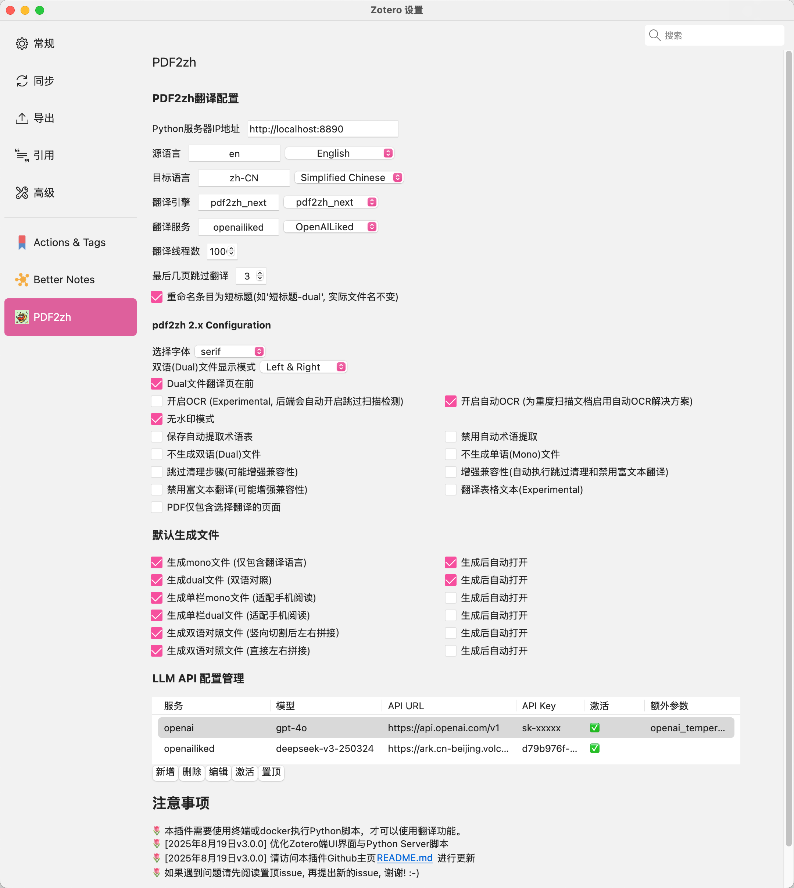
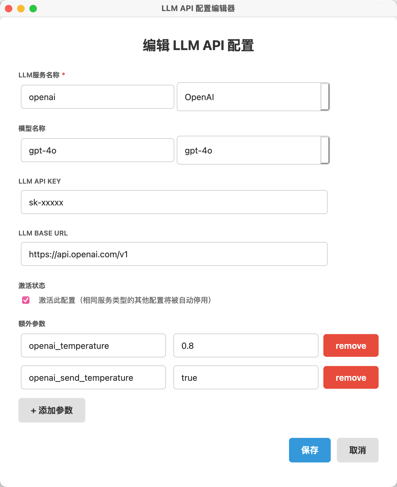
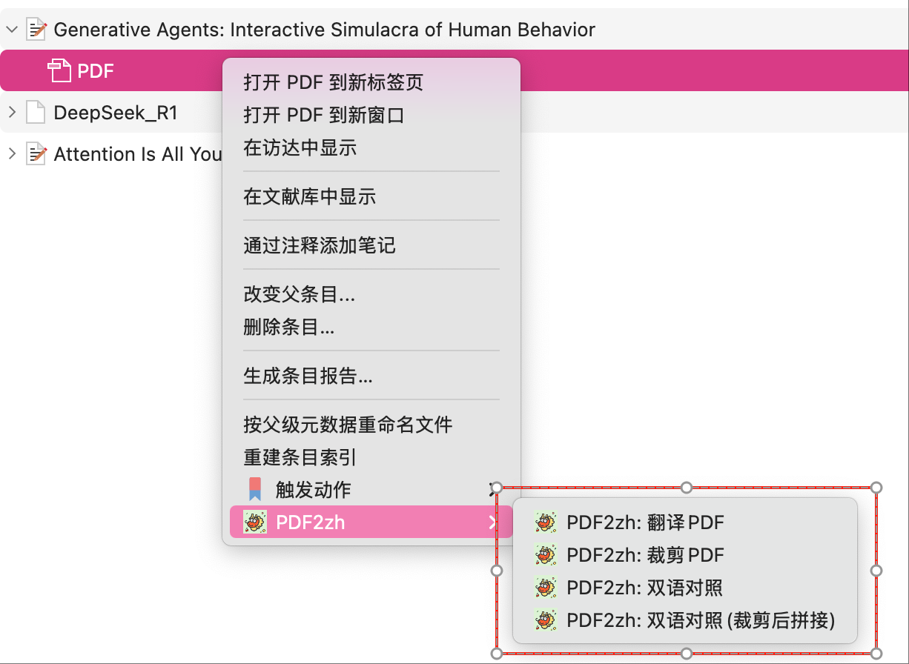
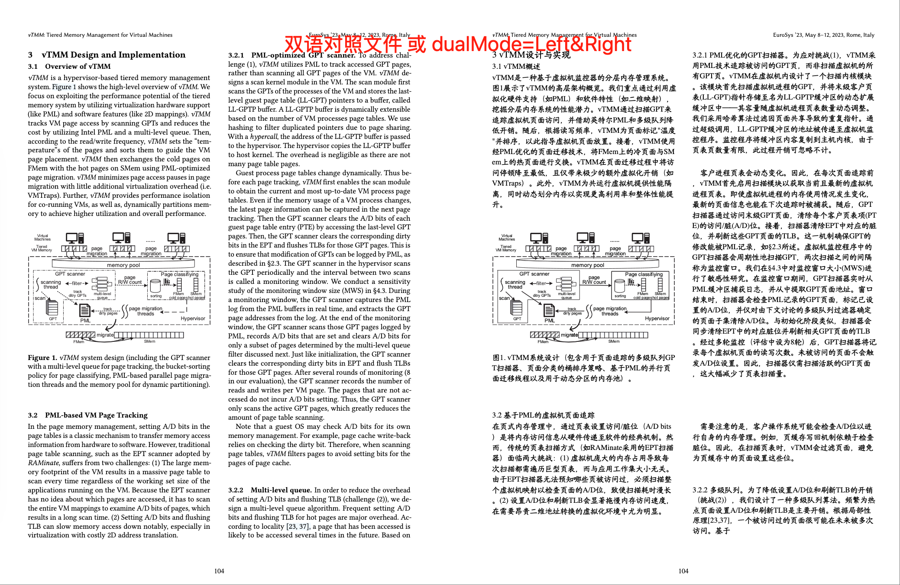

<div align="center">


<h2 id="title">Zotero PDF2zh</h2>

[](https://www.zotero.org)
[](https://github.com/windingwind/zotero-plugin-template)

[](https://github.com/guaguastandup/zotero-pdf2zh/blob/main/LICENSE)

在Zotero中使用[PDF2zh](https://github.com/Byaidu/PDFMathTranslate)和[PDF2zh_next](https://github.com/PDFMathTranslate/PDFMathTranslate-next)

新版本v3.0.20 | [旧版本v2.4.3](./2.4.3%20version/README.md)

</div>

# 如何使用本插件

本指南将引导您完成 Zotero PDF2zh 插件的安装和配置。

❓ 遇到问题

- 阅读[**常见问题文档**](https://docs.qq.com/markdown/DU0RPQU1vaEV6UXJC)
- 尝试向AI提问
- 在github issue区提问
- **将终端报错复制到txt文件，并截图zotero插件设置端配置**，将错误发送到本插件用户QQ群: 971960014，入群验证回答: github
- 访问网络上的视频教程，感谢大家的视频教程！
    - 来自小红薯[@jiajia](https://www.xiaohongshu.com/user/profile/631310d8000000001200c3a1?channelType=web_engagement_notification_page&channelTabId=mentions&xsec_token=AB6wOtAu2rBNcN8WfzJS72pVX6rDZYfWMImRRCx98yX6w%3D&xsec_source=pc_notice)的视频教程: [【zotero PDF文献翻译，免费无需会员，超简单 - jiajia | 小红书】]( https://www.xiaohongshu.com/discovery/item/68b6cce7000000001c00a555?source=webshare&xhsshare=pc_web&xsec_token=ABI-0NjKTM_1mc2td-UyiWIG4RSUAyxmi2HC8oGmS852I=&xsec_source=pc_share)
- 想要使用Docker进行部署？
    - 请参考：[Docker部署方法一](./docker/README.md) by [@Rosetears520](https://github.com/Rosetears520)
    - 请参考：[Docker部署方法二](./docker2/README.md) by [@taozhe6](https://github.com/taozhe6)


# 安装说明

## 第零步：安装Python和Zotero

- [Python下载链接](https://www.python.org/downloads/) 建议下载3.12.0版本Python

- 插件目前支持[Zotero 7](https://www.zotero.org/download/)，Zotero 8待适配

## 第一步: 安装uv/conda（可选）

如果不使用虚拟环境管理，请参考[FAQ](https://github.com/guaguastandup/zotero-pdf2zh?tab=readme-ov-file#faq)

**uv安装(推荐)**

1. 安装uv
```shell
# 方法一: 使用pip安装uv
pip install uv

# 方法二: 下载脚本安装
# macOS/Linux
wget -qO- https://astral.sh/uv/install.sh | sh
# windows
powershell -ExecutionPolicy ByPass -c "irm https://astral.sh/uv/install.ps1 | iex"
```

2. 检查uv安装是否成功
```shell
# 显示uv版本号, 则uv安装完成
uv --version
```

**conda安装**

1. 安装conda
参考本链接安装: https://www.anaconda.com/docs/getting-started/miniconda/install#windows-command-prompt

2. 检查conda安装是否成功
```shell
# 显示conda版本号, 则conda安装完成
conda --version
```

## 第二步: 下载项目文件

```shell
# 1. 创建并进入zotero-pdf2zh文件夹
mkdir zotero-pdf2zh && cd zotero-pdf2zh

# 2. 下载并解压server文件夹
# 如果server.zip下载失败, 可以直接访问: https://github.com/guaguastandup/zotero-pdf2zh/releases/download/v3.0.20-beta/server.zip 手动下载
wget https://raw.githubusercontent.com/guaguastandup/zotero-pdf2zh/refs/heads/main/server.zip
unzip server.zip

# 3. 进入server文件夹
cd server
```

## 第三步: 准备环境并执行

```shell
# 1. 安装依赖
pip install -r requirements.txt

# 2. 执行脚本
# 默认开启虚拟环境管理
# 默认使用uv进行虚拟环境管理
# 默认自动检查更新
# 默认端口号为8890
# 默认不开启winexe模式
# 默认启用国内镜像进行必要包安装
python server.py


# 可选: 命令行参数:
# 如果要关闭虚拟环境管理
python server.py --enable_venv=False
# 如果要切换虚拟环境管理工具为conda
python server.py --env_tool=conda
# 如果要切换端口号
python server.py --port={Your Port Num}
# 如果要关闭自动检查更新:
python server.py --check_update=False
# 如果要关闭包安装时启用镜像:
python server.py --enable_mirror=Flase

# new feature for Windows user: 开启windows exe安装模式, 安装pdf2zh_next exe版本，将可执行文件路径输入到命令行参数(例如./pdf2zh-v2.4.3-BabelDOC-v0.4.22-win64/pdf2zh/pdf2zh.exe)
python server.py --enable_winexe=True --winexe_path='xxxxxxx'
```

## 第四步: 下载并安装插件

新版本v3.0.20[下载链接](https://github.com/guaguastandup/zotero-pdf2zh/releases/download/v3.0.20-beta/zotero-pdf-2-zh-v3.0.20.xpi)

在zotero中打开“工具-插件”，将xpi文件拖入，进行安装。（若拖入后功能未生效，请重启Zotero后再试）

## 第五步: Zotero端插件设置



**💡 插件设置介绍**

- 免费&免配置的翻译服务:
    - 👍**siliconflowfree**
        - 基于硅基流动提供的GLM4-9B模型, 仅支持翻译引擎pdf2zh_next，由[@硅基流动](https://www.siliconflow.cn/)、[@pdf2zh_next](https://github.com/PDFMathTranslate/PDFMathTranslate-next) 和 [@BabelDOC](https://github.com/funstory-ai/BabelDOC)联合提供服务
    - bing/google
- 免费的翻译服务:
    - **zhipu**(GLM-4.5-Flash模型免费, 需配置API Key)
- 具有优惠/赠送的翻译服务:
    - 加入**[火山引擎协作计划](https://console.volcengine.com/ark/region:ark+cn-beijing/openManagement?LLM=%7B%7D&OpenAuthorizeModal=true&OpenTokenDrawer=false)**, 可以享受每个模型最高50w赠送额度(翻译配置选择openailiked)
        - 火山引擎的Token赠送量取决于前一天的Token使用量，请注意在火山引擎管理台观察服务赠送Token用量，避免支付超额费用
        - 本服务支持高线程数, 可将线程数设置为500~2000
    - 硅基流动: 通过邀请好友可以获得14元赠送金额
        - 注意，此服务url需填写为: `https://api.siliconflow.cn/v1`

- openailiked可以填写所有兼容openai格式的LLM服务, 您需要填写您的LLM服务供应商提供的URL, API Key, Model名称等信息。
    - 示例: 火山引擎url填写为`https://ark.cn-beijing.volces.com/api/v3`

**💡 注意事项**

- ⚠️⚠️（老用户必看！） 为了避免端口冲突，新版server脚本默认端口号为8890, 旧版本用户需要将Zotero配置页面的Python Server IP修改为: `http://localhost:8890`
- 切换翻译引擎pdf2zh/pdf2zh_next, 界面将显示不同引擎的翻译配置
- 翻译引擎pdf2zh的自定义字体：字体文件路径为本地路径。如果采用远端服务器部署, 暂时无法使用本配置，则需要手动修改`config.json`文件中的`NOTO_FONT_PATH`字段。
- 目前, 额外配置参数名需要与config文件中的字段相同(例如在pdf2zh_next中, openai对应的额外配置: `openai_temperature`和`openai_send_temperature`与`config.toml`文件中的字段相对应), 本功能将在未来继续优化, 可参考[文档](./server/doc/extraData.md)



## 第六步

在Zotero中对条目/PDF右键，选择PDF2zh-翻译选项，进行翻译。

### 关于翻译选项

对条目/附件单击右键, 可以看到四个翻译选项:



**💡 翻译选项解析**

- **翻译PDF**: 点击原文PDF或论文条目, 将会生成在Zotero插件设置端所选择的默认生成文件
- **裁剪PDF**: 选择dual/mono类型附件, 将会对选择的附件在宽度1/2处裁剪, 然后上下拼接, 此功能适合手机阅读
    - 本选项会将页面两侧空白处进行裁剪
    - 若产生截断了原文内容的情况, 可将`server/utils/config.py`中的`config.pdf_w_offset`值降低
- **双语对照**: 点击此选项, 会生成左边为原文, 右边为翻译后文本的PDF
    - 选择"Dual文件翻译页在前"可以交换生成顺序
    - 此选项等同于翻译引擎为pdf2zh_next, 且`双语(Dual)文件显示模式`为**Left&Right**时生成的文件
- **双语对照(裁剪):** 此选项针对双栏PDF论文, 将会在每页生成单栏双语对照内容

示例:



# FAQ

- Q：我的conda/uv安装失败了，我不想使用虚拟环境管理，怎么办？
- A：如果您只使用pdf2zh_next/pdf2zh引擎中的一个，并且全局python版本为3.12.0，可以不使用虚拟环境管理，执行如下命令即可：
```shell
# 1. 创建并进入zotero-pdf2zh文件夹
mkdir zotero-pdf2zh && cd zotero-pdf2zh

# 2. 下载并解压server文件夹
# 如果server.zip下载失败, 可以直接访问: https://github.com/guaguastandup/zotero-pdf2zh/releases/download/v3.0.20-beta/server.zip 手动下载
wget https://raw.githubusercontent.com/guaguastandup/zotero-pdf2zh/refs/heads/main/server.zip
unzip server.zip

# 3. 进入server文件夹
cd server

# 4. 安装执行包
pip install -r requirements.txt
# 如果只使用pdf2zh:
pip install pdf2zh==1.9.11 numpy==2.2.0
# 如果只使用pdf2zh_next:
pip install pdf2zh_next
# 或者
uv pip install pdf2zh_next

# 5. 执行脚本
# 关闭虚拟环境管理
# 默认自动检查更新
# 默认端口号为8890
# 默认不开启winexe模式
python server.py --enable_venv=False
```

# 致谢

- @Byaidu [PDF2zh](https://github.com/Byaidu/PDFMathTranslate)
- @awwaawwa [PDF2zh_next](https://github.com/PDFMathTranslate/PDFMathTranslate-next)
- @windingwind [zotero-plugin-template](https://github.com/windingwind/zotero-plugin-template)
- [沉浸式翻译](https://immersivetranslate.com)为本项目的活跃贡献者赞助每月Pro会员兑换码，详情请见：[CONTRIBUTOR_REWARD.md](https://github.com/funstory-ai/BabelDOC/blob/main/docs/CONTRIBUTOR_REWARD.md)

# 贡献者

<a href="https://github.com/guaguastandup/zotero-pdf2zh/graphs/contributors"> </a>

# 如何支持我

💐 免费开源插件，您的支持是我继续开发的动力～
- ☕️ [Buy me a coffee (Wechat/Alipay)](https://github.com/guaguastandup/guaguastandup) 请在备注中留下您希望出现在赞助者名单的姓名或昵称💗
- 🐳 [爱发电](https://afdian.com/a/guaguastandup)
- 🤖 SiliconFlow邀请链接: https://cloud.siliconflow.cn/i/WLYnNanQ
- [赞助者名单(待更新）](./docs/sponsors.md)
