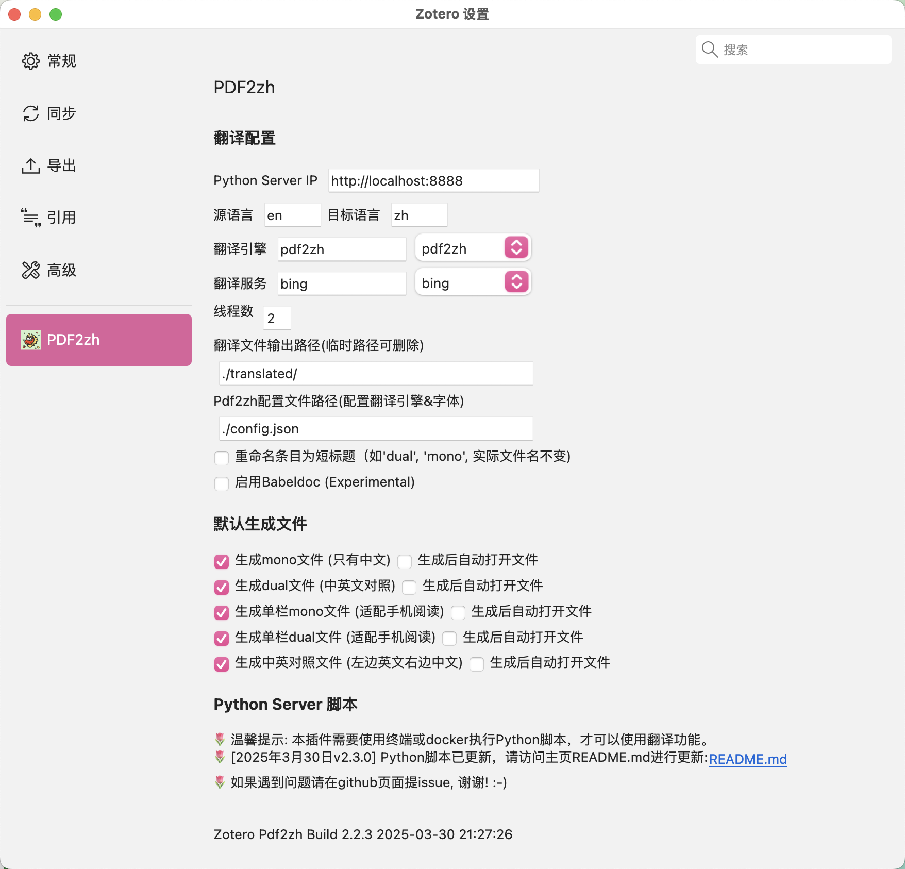
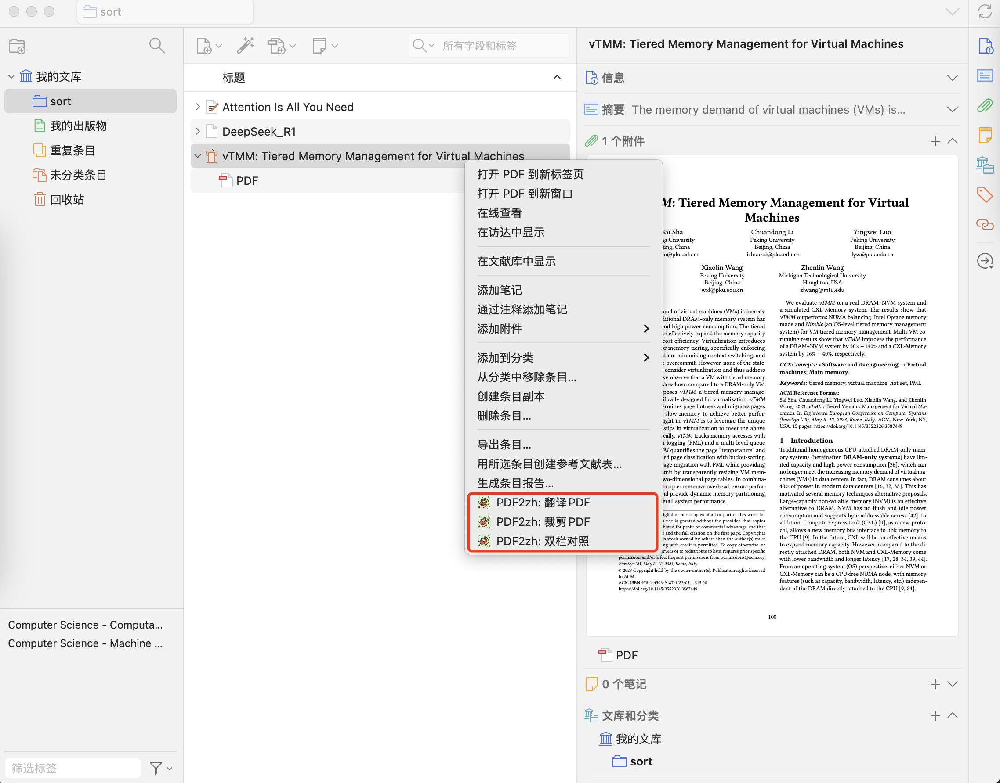
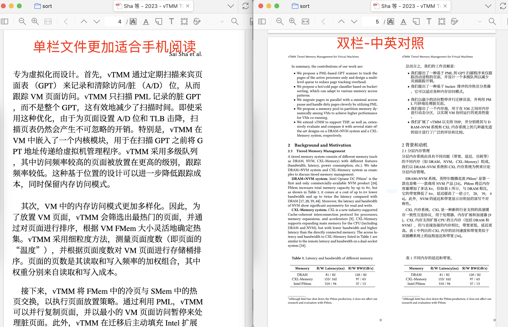

# Zotero PDF2zh


[](https://www.zotero.org)
[](https://github.com/windingwind/zotero-plugin-template)

[](https://github.com/guaguastandup/zotero-pdf2zh/blob/main/LICENSE)

<!--  -->

在Zotero中使用[PDF2zh](https://github.com/Byaidu/PDFMathTranslate)

# 如何使用本插件

## 第零步 安装PDF2zh

**docker或docker compose方式启动此步骤跳过。**

1.  在本地安装Python(3.10 <= version <=3.12)
2.  在本地安装最新的[PDF2zh](https://github.com/Byaidu/PDFMathTranslate)

```cmd
pip install uv
uv tool install --python 3.12 pdf2zh
```

或

```cmd
pip install pdf2zh  # 安装pdf2zh
pip install --upgrade pdf2zh # 更新pdf2zh
pdf2zh --version  # 检验是否正常安装
```

3.  测试PDF2zh的安装

```cmd
pdf2zh document.pdf # document.pdf是待翻译的文件
```

本插件当前开发使用的 `pdf2zh`版本: `v1.9.6`

## 第一步 在Zotero中配置插件参数



### Step 1.1 设置翻译参数

| 选项             | 值                            | 备注                                                                                                                                                                                                                 |
| ---------------- | ----------------------------- | -------------------------------------------------------------------------------------------------------------------------------------------------------------------------------------------------------------------- |
| Python Server IP | 默认为`http://localhost:8888` | 其中8888为翻译端口号，可以自行修改                                                                                                                                                                                   |
| 源语言           | 默认为`en`                    | 翻译源语言，默认为英文                                                                                                                                                                                               |
| 目标语言         | 默认为`zh`                    | 翻译目标语言，默认为中文                                                                                                                                                                                             |
| 翻译引擎         | `pdf2zh`                      | 目前仅支持PDF2zh                                                                                                                                                                                                     |
| 翻译服务         | 默认为`bing`                  | 翻译服务，可以从下拉菜单选择或自行输入。与配置文件中的`translators`对应。                                                                                                                                            |
| 线程数           | 默认为`4`                     | PDF2zh在翻译时的执行线程数                                                                                                                                                                                           |
| 翻译文件输出路径 | 默认为`./translated/`         | 用于临时存储翻译得到的PDF文件，可以在翻译完成后删除文件。                                                                                                                                                            |
| 配置文件路径     | 默认为`./config.json`         | 用于配置翻译引擎和字体                                                                                                                                                                                               |
| 重命名为短标题   | 默认勾选                      | 将新增文件的条目标题命名为短标题，包括：`mono`，`dual`，`dual-cut`，`mono-cut`，`compare`，但是不会改变原文件的命名；新功能：如果论文的元数据里包含短标题，则会重命名为：`短标题-dual`这种形式。（例如：`vLLM-dual`) |
| 启用babeldoc     | 默认不勾选                    | 是否在PDF2zh中启用`babeldoc`                                                                                                                                                                                         |
| 默认生成翻译     | 默认生成mono和dual文件        | 通过勾选默认生成的文件来控制添加到Zotero中的文件。同时可以进一步勾选是否在生成该文件后自动打开。临时文件夹中默认生成`mono`和`dual`两种文件。                                                                         |

> ## 💡Tips
>
> 1.  `dual`文件中包含源语言和目标语言，`mono`文件中仅包含目标语言
> 2.  以上Zotero设置面板的配置会覆盖Python脚本中的配置。如果不想在Zotero插件中进行配置，只想在Python脚本中配置，请将Zotero插件中的配置留空。
> 3.  以上路径建议设置为绝对路径。如果设置为相对路径，则根路径与接下来Python脚本执行的路径一致。
>     - 举例：如果python脚本在`/home/xxx/server/`下执行，翻译输出路径设置为临时路径`./translated/`，则实际的输出路径为`/home/xxx/server/translated/`

## 第二步：添加PDF2zh配置文件 & 修改翻译中文字体（可选 & 推荐)

1.  新建``config.json`文件，将该配置文件的路径输入到第一步的Zotero翻译配置中。

2.  `NOTO_FONT_PATH`为您的自定义字体路径。推荐下载使用[霞鹜文楷字体](https://github.com/lxgw/LxgwWenKai/releases/download/v1.510/LXGWWenKai-Regular.ttf)，具有更强的可读性。

- 如果使用docker方法启动，则需要挂载该字体文件: `- ./zotero-pdf2zh/LXGWWenKai-Regular.ttf:/app/LXGWWenKai-Regular.ttf`

3.  `translators`中配置多个AI翻译引擎。如果使用默认的bing或者google则不需要配置，推荐使用**智谱AI**服务。

4.  其他的配置设置，请参考PDF2zh原文档： [PDF2zh Config File](https://github.com/Byaidu/PDFMathTranslate/blob/main/docs/ADVANCED.md#cofig)

`config.json`文件示例如下:

```json
{
    "USE_MODELSCOPE": "0",
    "PDF2ZH_LANG_FROM": "English",
    "PDF2ZH_LANG_TO": "Simplified Chinese",
    "NOTO_FONT_PATH": "./LXGWWenKai-Regular.ttf",
    "translators": [
        {
            "name": "openai",
            "envs": {
                "OPENAI_BASE_URL": "https://api.openai.com/v1",
                "OPENAI_API_KEY": "sk-xxxx-xxxxxxx",
                "OPENAI_MODEL": "gpt-4o-mini"
            }
        },
        {
            "name": "ollama",
            "envs": {
                "OLLAMA_HOST": "http://127.0.0.1:11434",
                "OLLAMA_MODEL": "qwen2.5:7b"
            }
        },
        {
            "name": "deepseek",
            "envs": {
                "DEEPSEEK_API_KEY": "sk-xxxxxxx",
                "DEEPSEEK_MODEL": "deepseek-chat"
            }
        },
        {
            "name": "silicon",
            "envs": {
                "SILICON_API_KEY": "sk-xxxxxx",
                "SILICON_MODEL": "deepseek-ai/DeepSeek-V3"
            }
        },
        {
            "name": "gemini",
            "envs": {
                "GEMINI_API_KEY": "xxxxxx",
                "GEMINI_MODEL": "gemini-1.5-flash"
            }
        },
        {
            "name": "zhipu",
            "envs": {
                "ZHIPU_API_KEY": "xxxxxx",
                "ZHIPU_MODEL": "glm-4-flash"
            }
        },
        {
            "name": "qwen-mt",
            "envs": {
                "ALI_MODEL": "qwen-max-2025-01-25",
                "ALI_API_KEY": "sk-xxxxxxxxxx",
                "ALI_DOMAINS": "scientific paper"
            }
        }
    ]
}
```

## 第三步 执行脚本

### 方法一：命令行方式启动

打开命令行工具，输入以下命令：

```shell
# 1. 自动或手动下载脚本文件
wget https://github.com/guaguastandup/zotero-pdf2zh/raw/refs/heads/main/server.py
# 2. 执行脚本文件, 命令行参数8888为端口号，可以自行修改
python server.py 8888
```

> ## 💡Tips
>
> - 请注意，如果命令行修改了端口号，那么在第一步的Zotero配置中，也需要相应地修改端口号。

### 方法二：docker方式启动

checkout代码或者下载Dockerfile文件

```cmd
docker build --build-arg ZOTERO_PDF2ZH_FROM_IMAGE=byaidu/pdf2zh:1.9.6 --build-arg ZOTERO_PDF2ZH_SERVER_FILE_DOWNLOAD_URL=https://raw.githubusercontent.com/guaguastandup/zotero-pdf2zh/refs/tags/v2.3.1/server.py -t zotero-pdf2zh .
docker run zotero-pdf2zh
```

### 方法三：docker-compose方式启动

checkout代码或者下载Dockerfile、docker-compose.yaml文件

```cmd
docker compose build
docker compose up -d
```

## 第四步 翻译文件

打开Zotero，右键选择条目或者附件。
如果选择条目，将会自动选择该条目下创建时间**最早**的PDF。



### 选项一：PDF2zh：翻译PDF

本选项生成的文件由Zotero插件设置中的“默认生成文件”勾选项决定，默认生成mono和dual两个文件。

### 选项二：PDF2zh：裁剪PDF

本选项仅将选中的pdf文件由双栏文件切割为单栏文件。

✨ 将双栏论文剪切拼接为单栏显示，适配手机阅读!

得到后缀中包含`cut`的单栏PDF文件。

### 选项三：PDF2zh：双栏对照

本选项仅将后缀包含`dual`的文件切割拼接为中英文对照文件。

得到后缀中包含`compare`的中英双栏对照PDF文件。

> ## 💡Tips
>
> 双栏对照(Compare)方法仅对双栏PDF有限。
>
> 如果需要对单栏的PDF生成左右对照的文件，有两种方法：
>
> 1.  可以启用`babeldoc`，其生成的`dual`文件就是左右中英对照的文件。
> 2.  不启用`babeldoc`，打开生成的`dual`文件，然后在Zotero阅读器页面右键，打开`竖向分割`，便可以进行左右对照。

## 翻译效果展示




# 致谢

- @Byaidu [PDF2zh](https://github.com/Byaidu/PDFMathTranslate)
- @windingwind [zotero-plugin-template](https://github.com/windingwind/zotero-plugin-template)

# 贡献者

<a href="https://github.com/guaguastandup/zotero-pdf2zh/graphs/contributors">  </a>

# 💗

欢迎提issue或者参与贡献

提issue前请先阅读本链接：[常见问题](https://github.com/guaguastandup/zotero-pdf2zh/issues/64)

# TODO LIST

- [ ] 基于babeldoc在Zotero端显示翻译进度
- [ ] 提供共享远程翻译服务（基于SealOS）
- [ ] 支持Obsidian式配置（不需要打开设置页面）
- [ ] 增加Drop Last功能，跳过引用文献不翻译
- [x] 兼容babeldoc
- [x] 支持远程部署
- [x] 适配[PolyglotPDF](https://github.com/CBIhalsen/PolyglotPDF/tree/main)
    - [参考该issue](https://github.com/guaguastandup/zotero-pdf2zh/issues/67)
- [x] 完善Docker部署文档
- [x] 加入插件市场
- [x] 支持在zotero perference中设置pdf2zh参数

# 如何支持我

可以访问Siliconflow邀请链接注册账号，注册和邀请双方都可以获得14元赠送金额，我会在未来考虑开放公共服务端口（正在寻求低成本的方法，欢迎给出建议）。

- [SiliconFlow邀请链接](https://cloud.siliconflow.cn/i/a7s9DdQR) 邀请码：a7s9DdQR
- [InfiniCloud](https://infini-cloud.net/en/) 邀请码：5UPJW
