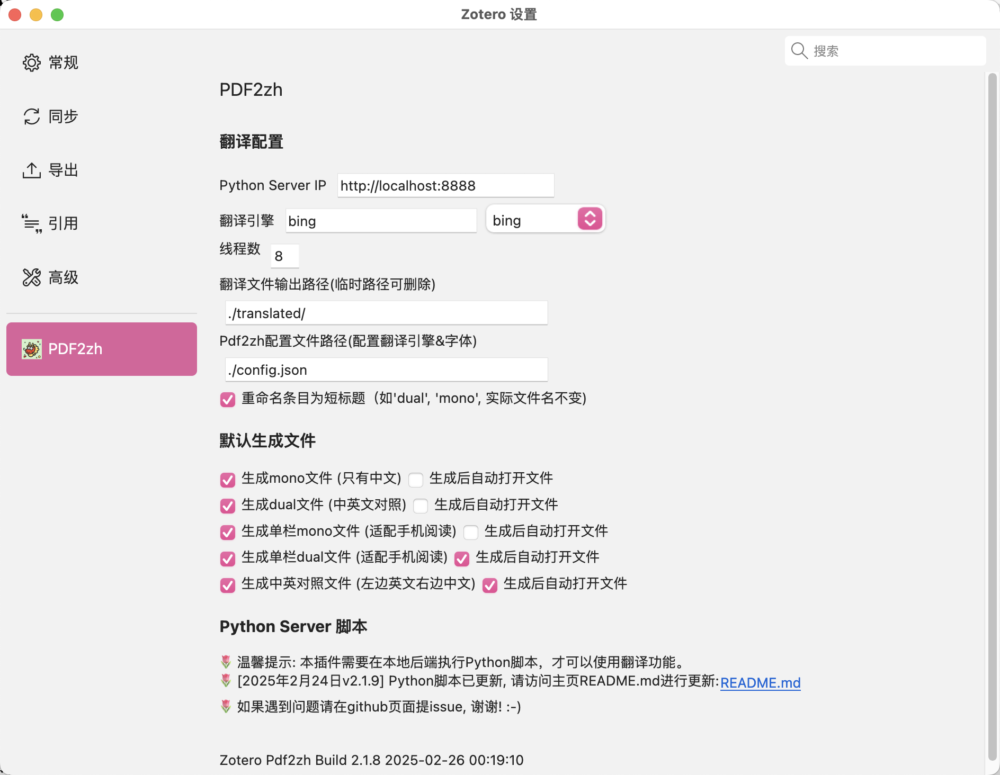
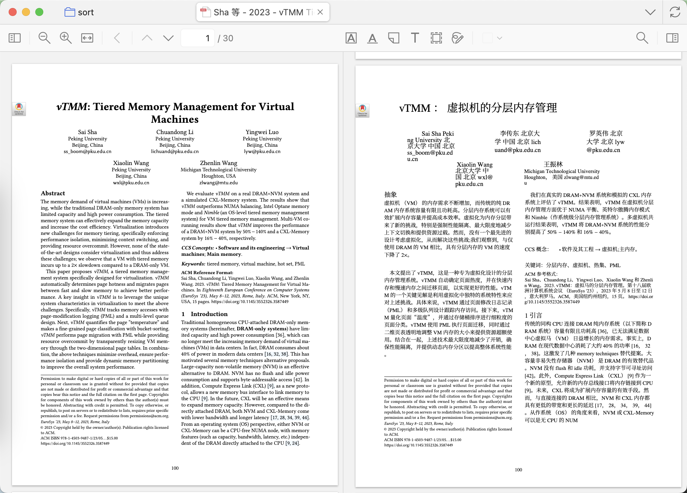

# Zotero PDF2zh


[](https://www.zotero.org)
[](https://github.com/windingwind/zotero-plugin-template)

[](https://github.com/guaguastandup/zotero-pdf2zh/blob/main/LICENSE)

<!--  -->

在Zotero中使用[PDF2zh](https://github.com/Byaidu/PDFMathTranslate)

# 配置方法

## 第零步 安装PDF2zh

**docker或docker compose方式启动此步骤跳过。**

在本地安装最新的[PDF2zh](https://github.com/Byaidu/PDFMathTranslate)

```cmd
pip install pdf2zh          # 安装pdf2zh
或
pip install --upgrade pdf2zh # 之前已经安装, 更新
```

本插件当前开发使用的 `pdf2zh`版本: `v1.9.1`

## 第一步 在Zotero中配置插件参数



### Step 1.1 设置翻译参数

> - Python Server IP 默认为`http://localhost:8888`, 其中8888为翻译端口号，可以自行修改；
> - 翻译引擎：默认为bing；(可以从下拉菜单选择，也可以自行输入)
> - 线程数：PDF2zh在翻译时的执行线程数，默认为4；
> - 翻译文件输出路径：用于临时存储翻译得到的PDF文件，默认为空；
> - Pdf2zh配置文件路径：用于配置翻译引擎和字体，默认为空。
> - 重命名为短标题：将新增文件的条目标题命名为短标题，包括：`mono`，`dual`，`dual-cut`，`mono-cut`，`compare`，但是不会改变原文件的命名。

以上路径建议设置为绝对路径。

如果设置为相对路径，则根路径与接下来Python脚本执行的路径一致。

> 举例：如果python脚本在`/home/xxx/server/`下执行，翻译输出路径设置为临时路径`./translated/`，则实际的输出路径为`/home/xxx/server/translated/`

### Step 1.2 设置默认生成的翻译文件格式

默认生成mono和dual文件。

通过勾选默认生成的文件来控制添加到Zotero中的文件。

同时可以进一步勾选是否在生成该文件后自动打开。

（请注意，此时临时翻译文件路径里依然存在mono和dual两种文件，因为这是pdf2zh默认生成的）

## 第二步：添加PDF2zh配置文件 & 修改翻译中文字体（可选 & 推荐)

新建``config.json`文件，将该配置文件的路径输入到第一步的Zotero翻译配置中。

推荐使用[霞鹜文楷字体](https://github.com/lxgw/LxgwWenKai/releases/download/v1.510/LXGWWenKai-Regular.ttf)

`config.json`文件示例如下:

```json
{
    "NOTO_FONT_PATH": "./LXGWWenKai-Regular.ttf",
    "translators": [
        {
            "name": "openai",
            "envs": {
                "OPENAI_BASE_URL": "https://api.openai.com/v1",
                "OPENAI_API_KEY": "sk-xxxxxxxxx-xxxxxxxxxx-xxxxxxxxxxxxx",
                "OPENAI_MODEL": "gpt-4o-mini"
            }
        }
    ]
}
```

`NOTO_FONT_PATH`为您的自定义字体路径。

`translators`中可以配置多个AI翻译引擎（如果使用默认的bing或者google则不需要配置）。

其他配置的修改同理: 具体参考: [PDF2zh Config File](https://github.com/Byaidu/PDFMathTranslate/blob/main/docs/ADVANCED.md#cofig)

## 第三步 执行脚本

### **命令行方式启动**

打开命令行工具，输入以下命令：

```shell
# 1. 下载脚本文件
wget https://github.com/guaguastandup/zotero-pdf2zh/raw/refs/heads/main/server.py
# 2. 执行脚本文件, 命令行参数8888为端口号，可以自行修改
python server.py 8888
```

或手动下载脚本：[Python脚本](https://github.com/guaguastandup/zotero-pdf2zh/raw/refs/heads/main/server.py)

请注意，如果命令行修改了端口号，那么在第一步的Zotero配置中，也需要相应地修改端口号。

Zotero插件配置会覆盖Python脚本中的配置。如果不想在Zotero插件中进行配置，只想在Python脚本中配置，请将Zotero插件中的配置留空。

### **docker方式启动**

checkout代码或者下载Dockerfile文件

```cmd
docker build --build-arg ZOTERO_PDF2ZH_FROM_IMAGE=byaidu/pdf2zh:1.9.5 --build-arg ZOTERO_PDF2ZH_SERVER_FILE_DOWNLOAD_URL=https://raw.githubusercontent.com/guaguastandup/zotero-pdf2zh/refs/tags/v2.2.3/server.py -t zotero-pdf2zh .
docker run zotero-pdf2zh
```

### **docker-compose方式启动**

checkout代码或者下载Dockerfile、docker-compose.yaml文件

```cmd
docker compose build
docker compose up -d
```

## 第四步 翻译文件


打开Zotero，右键选择条目或者附件。
如果选择条目，将会自动选择该条目下创建时间最早的PDF。

### 选项一：PDF2zh：Translate PDF

本选项生成的文件由Zotero插件设置中的“默认生成文件”勾选项决定，默认生成mono和dual两个文件。


### 选项二：PDF2zh：Cut PDF

本选项仅将选中的pdf文件由双栏文件切割为单栏文件。

✨ 将双栏论文剪切拼接为单栏显示，适配手机阅读!


得到后缀中包含`cut`的单栏PDF文件。



### 选项三：PDF2zh：中英双栏对照

本选项仅将后缀包含`dual`的文件切割拼接为中英文对照文件。


得到后缀中包含`compare`的中英双栏对照PDF文件。


# 致谢

- @Byaidu [PDF2zh](https://github.com/Byaidu/PDFMathTranslate)
- @windingwind [zotero-plugin-template](https://github.com/windingwind/zotero-plugin-template)

# 贡献者

<a href="https://github.com/guaguastandup/zotero-pdf2zh/graphs/contributors">  </a>

# 💗

欢迎提issue或者参与贡献

# TODO LIST

- [ ] 提供共享远程翻译服务（基于SealOS）
- [ ] 批量翻译功能优化
- [ ] 兼容babeldoc
- [ ] Zotero端显示翻译进度
- [ ] 支持Obsidian式配置（不需要打开设置页面）
- [ ] 支持远程部署
- [ ] 取消传递绝对路径，只传输文件名
- [ ] 跨平台部署测试 (on-going)
- [x] 完善Docker部署文档
- [x] 加入插件市场
- [x] 支持在zotero perference中设置pdf2zh参数

# 其他

- [SiliconFlow邀请链接](https://cloud.siliconflow.cn/i/a7s9DdQR) 邀请码：a7s9DdQR
- [InfiniCloud](https://infini-cloud.net/en/) 邀请码：5UPJW
