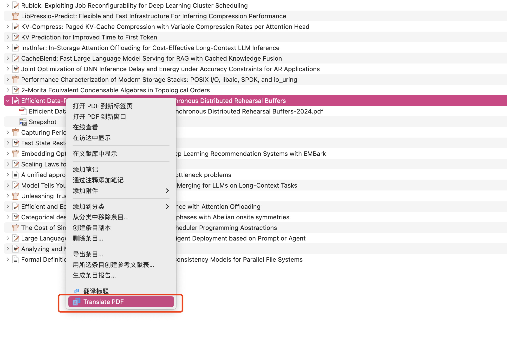

# Zotero PDF2zh

[](https://github.com/windingwind/zotero-plugin-template)
[](https://github.com/guaguastandup/zotero-pdf2zh/blob/master/LICENSE)


> 在Zotero中使用[PDF2zh](https://github.com/Byaidu/PDFMathTranslate)

## 配置方法

### 第零步 

在本地安装[PDF2zh](https://github.com/Byaidu/PDFMathTranslate)

### 第一步

根据以下python脚本的注释, 按照个人需求修改配置，然后运行:

```python
from flask import Flask, request, jsonify
import subprocess
import os

pdf2zh = "pdf2zh"                   # 设置pdf2zh指令: 默认为'pdf2zh'
thread_num = 4                      # 设置线程数: 默认为4
translated_dir = "./translated/"    # 设置翻译文件的输出路径(临时路径, 可以在翻译后删除)
port_num = 8888                     # 设置端口号: 默认为8888

app = Flask(__name__)
@app.route('/translate', methods=['POST'])
def translate():
    data = request.get_json()
    input_path = data.get('filePath')
    try:
        os.makedirs(translated_dir, exist_ok=True)
        print(input_path)

        os.system(pdf2zh + ' ' + str(input_path).replace(' ', '\ ') + ' --t ' + str(thread_num)+ ' --o ' + translated_dir) # 执行pdf2zh翻译

        translated_path1 = os.path.join(translated_dir, os.path.basename(input_path).replace('.pdf', '-mono.pdf'))
        translated_path2 = os.path.join(translated_dir, os.path.basename(input_path).replace('.pdf', '-dual.pdf'))

        return jsonify({'status': 'success', 'translatedPath1': translated_path1, 'translatedPath2': translated_path2}), 200

    except subprocess.CalledProcessError as e:
        return jsonify({'status': 'error', 'message': e.stderr}), 500

if __name__ == '__main__':
    app.run(host='0.0.0.0', port=port_num)

```

### 第二步

在Zotero-设置中，输入您的Python Server IP + '/translate'


默认为: http://localhost:8888/translate

## 使用方法

右键选择条目或者附件 - 点击 Translate PDF 

条目中将会添加两个翻译后的文件


# 致谢
- @Byaidu [PDF2zh](https://github.com/Byaidu/PDFMathTranslate)
- @windingwind [zotero-plugin-template](https://github.com/windingwind/zotero-plugin-template)

# 💗

欢迎提issue或者参与贡献

