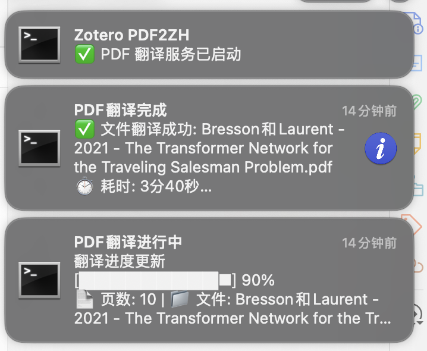

# Zotero 翻译服务自动启停教程 (macOS)



## 功能介绍

本项目旨在实现 Zotero 与外部翻译服务（通过 `server.py` 提供）的无缝集成。通过配置一个 macOS 后台服务，可以实现以下自动化流程：

-   **自动启停**：当您打开 Zotero 应用程序时，后台会自动启动 `server.py` 翻译服务；关闭 Zotero 时，服务也会被自动终止，释放系统资源。
-   **稳定守护**：在 Zotero 运行期间，如果 `server.py` 服务因任何原因意外崩溃，后台服务会检测到并在 10 秒内自动重启，确保服务的可用性。
-   **静默通知**：服务在启动、停止或翻译PDF时，都会通过macOS通知中心发送静默通知，让您能实时了解服务状态和翻译进度，而不会打扰您的工作流程。

本教程将指导你如何使用本文件夹中的三个脚本（`server.py`, `zotero_monitor.sh`, `com.user.zotero.monitor.plist`），配置这一自动化服务。

## 第一步：环境准备

在开始之前，请确保你的 macOS 系统已经安装了以下软件：

1.  **Homebrew**: macOS 的包管理器。如果未安装，请访问 [brew.sh](https://brew.sh) 获取安装命令。

2.  **Conda (Anaconda / Miniconda)**: 用于管理 Python 环境。推荐安装 [Miniconda](https://docs.conda.io/projects/miniconda/en/latest/)。

3.  **安装依赖包**:
    打开终端，运行以下命令安装必要的工具和 Python 包。

    ```bash
    # 1. 安装桌面通知工具
    brew install terminal-notifier

    # 2. 创建并激活 Conda 环境
    conda create --name zotero-pdf2zh python=3.12 -y
    conda activate zotero-pdf2zh

    # 3. 安装 Python 依赖库 (请根据你的实际需求增删)
    pip install Flask pypdf pdf2zh
    ```

## 第二步：放置和配置脚本

现在，我们将把本文件夹中的三个文件放置到系统的正确位置，并进行必要的修改。

### 1. `server.py` - 翻译服务

这是提供翻译功能的 Python 服务器。

*   **操作**:
    1.  创建一个项目文件夹，例如 `~/Documents/zotero-pdf2zh`。
        ```bash
        mkdir -p ~/Documents/zotero-pdf2zh
        ```
    2.  将本文件夹中的 `server.py` 文件**复制**到你刚创建的项目文件夹中。

### 2. `zotero_monitor.sh` - 监控脚本

此脚本负责监控 Zotero 进程并调用启停命令。

*   **操作**:
    1.  在你的用户主目录下创建一个 `Scripts` 文件夹（如果尚不存在）。
        ```bash
        mkdir -p ~/Scripts
        ```
    2.  将本文件夹中的 `zotero_monitor.sh` 文件**复制**到 `~/Scripts/` 目录。
    3.  **【重要】** 打开 `~/Scripts/zotero_monitor.sh` 文件，修改顶部的配置变量，确保路径正确。将 `YOUR_USERNAME` 替换为你的 macOS 用户名。
        ```sh
        # --- 配置 ---
        PROJECT_PATH="/Users/YOUR_USERNAME/Documents/zotero-pdf2zh"
        CONDA_ENV_NAME="zotero-pdf2zh"
        ```
    4.  赋予该脚本执行权限。
        ```bash
        chmod +x ~/Scripts/zotero_monitor.sh
        ```

### 3. `com.user.zotero.monitor.plist` - 后台服务配置

这是 macOS `launchd` 服务的配置文件，是实现自动化的核心。

*   **操作**:
    1.  将本文件夹中的 `com.user.zotero.monitor.plist` 文件**复制**到 `~/Library/LaunchAgents/` 目录。
    2.  **【重要】** 打开 `~/Library/LaunchAgents/com.user.zotero.monitor.plist` 文件，这是一个 XML 文件。你需要用你的真实信息**替换掉所有 `YOUR_USERNAME` 和 `YOUR_CONDA_ENV_NAME`** 的占位符。

        需要修改的地方包括：
        *   **ProgramArguments**: 监控脚本的完整路径。
        *   **StandardOutPath / StandardErrorPath**: 日志文件的完整路径。
        *   **EnvironmentVariables -> PATH**: 你的 Conda 环境 `bin` 目录的完整路径。

        **修改示例**:
        ```xml
        <!-- ... 其他内容 ... -->
        <key>ProgramArguments</key>
        <array>
            <string>/bin/bash</string>
            <!-- 将 YOUR_USERNAME 替换为你的用户名 -->
            <string>/Users/YOUR_USERNAME/Scripts/zotero_monitor.sh</string>
        </array>
        <!-- ... -->
        <key>StandardOutPath</key>
        <!-- 将 YOUR_USERNAME 替换为你的用户名 -->
        <string>/Users/YOUR_USERNAME/Documents/zotero-pdf2zh/logs/launchagent_out.log</string>
        <key>StandardErrorPath</key>
        <!-- 将 YOUR_USERNAME 替换为你的用户名 -->
        <string>/Users/YOUR_USERNAME/Documents/zotero-pdf2zh/logs/launchagent_err.log</string>
        <!-- ... -->
        <key>PATH</key>
        <!-- 将 YOUR_USERNAME 和 YOUR_CONDA_ENV_NAME 替换为你的配置 -->
        <string>/Users/YOUR_USERNAME/opt/anaconda3/envs/YOUR_CONDA_ENV_NAME/bin:/opt/homebrew/bin:/usr/local/bin:/usr/bin:/bin:/usr/sbin:/sbin</string>
        <!-- ... 其他内容 ... -->
        ```

### 4. 关于文件权限

为了确保服务能正常运行，正确设置文件权限非常重要：

-   **监控脚本 (`zotero_monitor.sh`)**：此脚本需要被系统执行，因此必须赋予它“可执行”权限。我们在之前的步骤中已经通过以下命令完成此操作：
    ```bash
    chmod +x ~/Scripts/zotero_monitor.sh
    ```
    这个命令会告诉系统，这个文件是一个可以运行的程序。

-   **服务配置 (`com.user.zotero.monitor.plist`)** 和 **Python 脚本 (`server.py`)**：这两个文件只需要被系统读取即可，它们不需要可执行权限。通常，当你创建或复制文件时，默认的读写权限（例如 `rw-r--r--` 或 `644`）已经足够，一般无需额外修改。

## 第三步：启动服务

完成以上所有配置后，打开终端，运行以下命令来加载并启动你的后台服务：

```bash
launchctl load ~/Library/LaunchAgents/com.user.zotero.monitor.plist
```

如果将来你需要修改脚本并重新加载服务，可以运行：
```bash
launchctl unload ~/Library/LaunchAgents/com.user.zotero.monitor.plist
launchctl load ~/Library/LaunchAgents/com.user.zotero.monitor.plist
```

## 第四步：验证和调试

服务现在应该已经在后台运行了。

*   **启动/关闭 Zotero**: 尝试打开和关闭 Zotero 应用程序。你应该会收到服务启动和停止的桌面通知。

*   **查看日志**: 如果遇到问题，日志是最好的朋友。
    *   **监控脚本日志**:
        ```bash
        tail -f ~/Documents/zotero-pdf2zh/logs/monitor.log
        ```
    *   **Python 服务日志**:
        ```bash
        tail -f ~/Documents/zotero-pdf2zh/logs/server.log
        ```

教程到此结束。

---

## 致谢与免责声明

### 开源与贡献
本项目作为一个开源解决方案，旨在为 Zotero 用户提供便利。代码中可能存在未知的 Bug 或潜在的安全风险，欢迎社区开发者一同参与，提出改进意见或代码贡献，使其更加完善和健壮。

特别地，目前的方案仅针对 macOS。我们非常期待有能力的开发者能将其移植到 **Windows** 和 **Linux** 平台，造福更广泛的用户群体。

### 上手门槛与配置
请注意，本方案具有一定的上手门槛，需要用户对命令行和文件路径有基本的了解。在部署时，请务必仔细检查并修改 `zotero_monitor.sh` 和 `com.user.zotero.monitor.plist` 文件中的所有路径和环境名称设置，确保它们与您的个人电脑配置完全一致。我们也期待有经验的开发者能帮助优化部署流程，进一步降低普通用户的上手门槛。

### **重要警告与免责声明**
此后台服务会持续在后台运行进程。如果您需要在电脑上运行任何带有**反作弊或系统监控软件**的程序（例如：**在线考试、远程面试、网络游戏**等），请务必**提前卸载或关闭**此后台服务，以避免任何潜在的冲突或被误判为作弊行为。

**卸载命令**:
```bash
launchctl unload ~/Library/LaunchAgents/com.user.zotero.monitor.plist
rm ~/Library/LaunchAgents/com.user.zotero.monitor.plist
```

**因使用此服务而导致的任何直接或间接问题，包括但不限于考试成绩无效、账号封禁等，本人概不负责。请您在充分理解其工作原理后，谨慎使用。**
